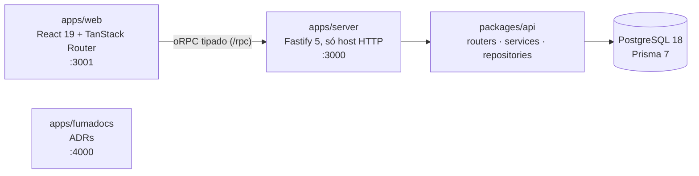

<div align="center">


<p><strong>Reconhecimento de equipe com pontuação, ranking e reuniões ao vivo.</strong></p>

<p>
  
  
  
  
</p>

<p>
  
  
  
  
  
  
</p>

<p>
  
  
  
  
  
  
  
  
</p>

<p>
  <a href="#-quick-start">Quick start</a> ·
  <a href="#-funcionalidades">Funcionalidades</a> ·
  <a href="#-arquitetura">Arquitetura</a> ·
  <a href="#-api">API</a> ·
  <a href="#-documentação">Documentação</a>
</p>

</div>

---

## Sobre

O **KPICorp** registra o engajamento de um time. O administrador cadastra **KPIs**:
indicadores de reconhecimento com pontuação, como "Presença na reunião", "Entrega no prazo"
ou "Encontrou bug crítico". Ele distribui esses KPIs aos membros, individualmente ou
**ao vivo durante a reunião**. Cada membro acumula pontos, sobe de nível, ganha badges e
acompanha a própria posição no ranking.

O fluxo principal cabe em poucos cliques: abrir a reunião, marcar presença (que já pontua)
e reconhecer quem se destacou enquanto a reunião acontece.

Monorepo TypeScript criado com
[Better-T-Stack](https://github.com/AmanVarshney01/create-better-t-stack).

## ✨ Funcionalidades

| Para o Admin | Para o Membro |
| --- | --- |
| Painel com totais do time, variação contra o período anterior, gráfico de pontos por semana, sparklines, top 5 do mês e top movers da semana | Painel próprio com pontos da semana, nível, posição no ranking e variação desde segunda |
| Banco de KPIs: criar, editar, ativar e desativar | Pontuação por categoria: presença, desempenho, comportamento e iniciativa |
| Membros: convite por link, busca, filtro, ativar/desativar, perfil completo | Nível de 0 a 20 em cinco faixas, de **Iniciante** a **Lenda** |
| **Modo reunião**: escalar participantes, marcar presença, atribuir KPIs ao vivo, pódio no encerramento | Dez badges: categoria, volume, constância semanal, pódio e presença |
| Atribuição individual e em massa, com revogação que preserva o histórico | Sequência de semanas pontuando ("🔥 N semanas") |
| Ranking por semana, mês, trimestre ou geral, com seta de variação | Ranking por semana, mês ou geral |

### Regras que valem em todo o produto

- **Pontuação congela na atribuição.** Reprecificar um KPI não reescreve o passado
  ([ADR 0015](apps/fumadocs/content/docs/adr/0015-atribuicao-imutavel-e-revogacao-logica.mdx)).
- **Revogar não apaga.** A atribuição sai da pontuação e fica no histórico.
- **Badge conquistada é permanente**, mesmo que o KPI que a gerou seja revogado
  ([ADR 0016](apps/fumadocs/content/docs/adr/0016-badges-carimbadas-na-leitura.mdx)).
- **Semana é a semana do calendário (segunda a domingo), no fuso de São Paulo**, igual
  para ranking, badges e painéis
  ([ADR 0017](apps/fumadocs/content/docs/adr/0017-janelas-de-calendario-em-sao-paulo.mdx)).
- **A API entrega o número pronto; o front só formata**
  ([ADR 0021](apps/fumadocs/content/docs/adr/0021-backend-entrega-o-numero-pronto.mdx)).

<details>
<summary><strong>Referência visual (mockup do protótipo)</strong></summary>

<br />

Telas do protótipo que guiou o front, em `docs/Mockup-KPICorp/`. São a referência
visual congelada, não capturas da aplicação atual.

| Login | Painel do Admin | Banco de KPIs |
| --- | --- | --- |
|  |  |  |

| Membros | Ranking | Modo reunião |
| --- | --- | --- |
|  |  |  |

</details>

## 🧱 Stack

| Camada | Tecnologia |
| --- | --- |
| Runtime | Node.js 24 (ESM puro) |
| Frontend | React 19, TanStack Router (file-based), TanStack Query, Vite 8 |
| Estilo | Tailwind CSS 4, shadcn/ui sobre Base UI, tema dark |
| Backend | Fastify 5 com oRPC (RPC e OpenAPI do mesmo router) |
| Banco | PostgreSQL 18 (Docker local) |
| ORM | Prisma 7 com driver adapter `pg` |
| Validação | Zod 4 (input, output e schema OpenAPI) |
| Autenticação | JWT (`jose`) com refresh token rotativo, bcrypt para senha |
| Testes | Vitest 4, Testing Library e jsdom no front |
| Qualidade | Biome (lint e format), Lefthook (pre-commit), TypeScript `strict` |
| Monorepo | Turborepo com npm workspaces |
| Documentação | Fumadocs (Next.js 16) para os ADRs |

## 🚀 Quick start

### Pré-requisitos

- **Node.js 24**: `nvm use` lê o `.nvmrc`
- **Docker** rodando, para o PostgreSQL local
- **Git**

Extensões recomendadas no VS Code: **Biome**, **Prisma**, **Tailwind CSS IntelliSense** e
**Docker**.

### Subir o projeto

```bash
# 1. dependências (o prepare instala os git hooks; o postinstall roda prisma generate)
npm install

# 2. variáveis de ambiente
cp apps/server/.env.example apps/server/.env
cp apps/web/.env.example apps/web/.env

# 3. PostgreSQL local
npm run db:start

# 4. migrations
npm run db:migrate

# 5. dados de desenvolvimento
npm run db:seed

# 6. web, API e docs juntos
npm run dev
```

| Serviço | URL |
| --- | --- |
| Web (Vite + TanStack Router) | http://localhost:3001 |
| API (Fastify + oRPC) | http://localhost:3000 |
| Referência OpenAPI | http://localhost:3000/api-reference |
| Docs e ADRs (Fumadocs) | http://localhost:4000 |

O endpoint RPC fica em `http://localhost:3000/rpc`. O front não faz `fetch` manual: usa o
client tipado em `apps/web/src/utils/orpc.ts`.

### Credenciais do seed

São 12 usuários, todos com a senha **`admin123`**:

| E-mail | Perfil |
| --- | --- |
| `admin@kpicorp.com` (Eduardo Santos, Chefe) | `ADMIN` |
| `marina.duarte@kapicorp.com` (Product Owner, 1ª do ranking, nível 20, todas as badges) | `MEMBER` |
| os outros dez, em `nome.sobrenome@kapicorp.com` | `MEMBER` |

O seed apaga e recria usuários, reuniões, atribuições, badges e snapshots a cada execução.
**Os KPIs nunca são alterados.** A lista completa está em
[`packages/db/CLAUDE.md`](packages/db/CLAUDE.md#seed). Use só em desenvolvimento local.

```bash
curl -s -X POST http://localhost:3000/rpc/auth/login \
  -H 'Content-Type: application/json' \
  -d '{"json":{"email":"admin@kpicorp.com","password":"admin123"}}'
```

Para testar a API manualmente, há uma coleção Postman em [`postman/`](postman/README.md).
O login guarda os tokens sozinho.

## ⚙️ Variáveis de ambiente

São validadas em runtime por `packages/env` (`@t3-oss/env-core` + Zod). Uma variável nova
só existe depois de declarada no schema. Ler `process.env` direto não é o padrão do
projeto.

### `apps/server/.env`

| Variável | Obrigatória | Default | Descrição |
| --- | --- | --- | --- |
| `DATABASE_URL` | Sim | — | Connection string do Postgres |
| `CORS_ORIGIN` | Sim | — | Origem aceita pelo CORS, validada como URL |
| `WEB_APP_URL` | Sim | — | Base dos links abertos no navegador, como o de convite. É separada do CORS: uma diz de onde se aceita requisição, a outra para onde se manda o usuário |
| `JWT_SECRET` | Sim | — | Assinatura do access token, com no mínimo 32 caracteres |
| `JWT_REFRESH_SECRET` | Sim | — | Assinatura do refresh token, com no mínimo 32 caracteres e diferente da anterior (validado no boot) |
| `JWT_ACCESS_EXPIRES_IN` | Não | `15m` | Vida do access token |
| `JWT_REFRESH_EXPIRES_IN` | Não | `7d` | Vida do refresh token |
| `HOST` | Não | `localhost` | Bind do Fastify |
| `PORT` | Não | `3000` | Porta do Fastify |
| `NODE_ENV` | Não | `development` | `development` \| `production` \| `test` |

Os dois segredos de JWT são separados de propósito: um access token roubado não pode ser
forjado como refresh token. Para gerar um segredo: `openssl rand -base64 48`.

### `apps/web/.env`

| Variável | Obrigatória | Default | Descrição |
| --- | --- | --- | --- |
| `VITE_SERVER_URL` | Sim | — | URL base da API |

Os schemas estão em `packages/env/src/server.ts` e `packages/env/src/web.ts`. Os `.env` são
ignorados pelo git; os `.env.example` são versionados. `SKIP_ENV_VALIDATION=1` pula a
validação (usado em build).

## 🏗️ Arquitetura



**`apps/server` não tem lógica de negócio.** Ele monta o router de `packages/api` em dois
transportes (RPC e OpenAPI) e escuta. Cada módulo da API segue três camadas
([ADR 0009](apps/fumadocs/content/docs/adr/0009-camadas-router-service-repository.mdx)):

```
router      → contrato (Zod), guard de perfil, chama o service
service     → regra de negócio, lança DomainError
repository  → única camada que fala com o Prisma
```

Módulo não importa módulo. Uma regra que dois módulos precisam vira função pura em
`packages/api/src/shared/`
([ADR 0018](apps/fumadocs/content/docs/adr/0018-regras-puras-em-shared.mdx)).

### Estrutura

```
kpi-corp/
├── apps/
│   ├── web/          # Frontend: Vite + React + TanStack Router (:3001)
│   ├── server/       # Host HTTP Fastify, sem regra de negócio (:3000)
│   └── fumadocs/     # Documentação e ADRs em Next.js (:4000)
├── packages/
│   ├── api/          # A API: módulos oRPC (router, service, repository)
│   ├── db/           # Schema Prisma, migrations, seed, docker-compose
│   ├── env/          # Schemas de env validados com Zod
│   ├── ui/           # Primitives shadcn/ui compartilhados
│   └── config/       # tsconfig base
├── postman/          # Coleção e environment para teste manual
└── docs/             # Arquitetura, módulos, specs, PRD, stories e mockup
```

| Você quer | Vá para |
| --- | --- |
| Endpoint novo | `packages/api/src/modules/<módulo>/` |
| Query nova | repository do módulo |
| Variável de ambiente | `packages/env/src/server.ts` ou `web.ts` |
| Modelo novo | `packages/db/prisma/schema/<nome>.prisma` |
| Primitive de UI | `packages/ui/src/components/` |
| Tela | `apps/web/src/pages/` (`routes/` só declara roteamento) |
| Decisão técnica | ADR em `apps/fumadocs/content/docs/adr/` |

## 🔌 API

São 36 procedures em 8 módulos. A referência completa, gerada do Zod, fica em
`http://localhost:3000/api-reference`.

| Módulo | Rotas | Acesso | Regras |
| --- | --- | --- | --- |
| `auth` | `login`, `refresh`, `logout`, `me`, `validateInvite`, `register` | público / autenticado | [auth.md](docs/modules/auth.md) |
| `members` | `GET /members`, `GET /members/{id}`, `POST /members/invitations`, `PATCH /members/{id}/status` | ADMIN | [members.md](docs/modules/members.md) |
| `kpis` | `POST /kpis`, `GET /kpis`, `GET /kpis/{id}`, `PUT /kpis/{id}`, `PATCH /kpis/{id}/status` | ADMIN | [kpis.md](docs/modules/kpis.md) |
| `assignments` | `POST /kpi-assignments`, `POST /kpi-assignments/bulk`, `GET /kpi-assignments`, `GET /members/{id}/kpi-assignments`, `DELETE /kpi-assignments/{id}` | ADMIN | [assignments.md](docs/modules/assignments.md) |
| `profile` | `GET /me/score`, `GET /me/kpis`, `GET /me/kpis/summary`, `GET /me/profile`, `GET /members/{id}/profile` | autenticado | [profile.md](docs/modules/profile.md) |
| `meetings` | `POST /meetings`, `GET /meetings`, `GET /meetings/{id}`, `POST …/attendees`, `POST …/attendance`, `POST …/kpi-assignments`, `POST …/end` | ADMIN | [meetings.md](docs/modules/meetings.md) |
| `ranking` | `GET /ranking?period=week\|month\|quarter\|all` | autenticado (`quarter` só ADMIN) | [ranking.md](docs/modules/ranking.md) |
| `dashboard` | `GET /dashboard/member`, `GET /dashboard/admin`, `GET /dashboard/admin/points-series` | autenticado / ADMIN | [dashboard.md](docs/modules/dashboard.md) |

## 📜 Scripts

Todos rodam da raiz. O Turborepo cuida do grafo.

| Script | O que faz |
| --- | --- |
| `npm run dev` | Sobe web, server e docs em paralelo |
| `npm run dev:web` / `npm run dev:server` | Sobe um app só |
| `npm run build` | Build de todos os apps |
| `npm run test` | Vitest em todos os pacotes |
| `npm run check-types` | `tsc --noEmit` em todos os pacotes |
| `npm run lint` | Biome em modo leitura |
| `npm run check` | Biome com `--write` |

### Banco

O `docker-compose.yml` fica em `packages/db/`, mas os comandos rodam da raiz:

```bash
npm run db:start     # sobe o PostgreSQL em background
npm run db:watch     # sobe em foreground, com logs
npm run db:migrate   # cria e aplica migration a partir do schema
npm run db:seed      # recria usuários, reuniões e atribuições (KPIs intactos)
npm run db:push      # aplica o schema sem gerar migration (protótipo)
npm run db:generate  # regenera o Prisma Client
npm run db:studio    # abre o Prisma Studio
npm run db:stop      # para os containers
npm run db:down      # para e remove os containers
```

O schema é dividido por modelo em `packages/db/prisma/schema/`, e um arquivo novo é
detectado automaticamente. O `DATABASE_URL` de todos os comandos Prisma vem de
`apps/server/.env`.

## 🧪 Testes

```bash
npm run test
```

| Pacote | Arquivos | Testes | O que cobre |
| --- | --- | --- | --- |
| `packages/api` | 28 | 617 | services, routers e regras puras de `shared/`, com repository simulado |
| `apps/web` | 27 | 337 | `lib/`, guards e cada tela contra a API simulada |

Os números são da execução de 2026-10-09.

## 🎨 UI compartilhada

As primitives shadcn/ui ficam em `packages/ui` e são compartilhadas pelos apps React.

```bash
# adicionar uma primitive compartilhada, da raiz
npx shadcn@latest add dialog popover -c packages/ui
```

```tsx
import { Button } from "@kpi-corp/ui/components/button";
```

Os design tokens e o CSS global estão em `packages/ui/src/styles/globals.css`.

## 🪝 Git hooks

O `npm install` instala o Lefthook pelo `prepare`. O `pre-commit` roda
`biome check --write` nos arquivos staged e adiciona de novo o que foi corrigido.

```bash
npx lefthook install          # reinstalar os hooks
npx lefthook run pre-commit   # executar manualmente
```

## 📚 Documentação

| Documento | Conteúdo |
| --- | --- |
| [Visão geral da arquitetura](docs/architecture/OVERVIEW.md) | C4 níveis 1 e 2, containers, fluxo de request |
| [Componentes internos](docs/architecture/COMPONENTS.md) | C4 nível 3, camadas de `packages/api` |
| [Decisões (ADR)](docs/architecture/decisions/README.md) | 21 decisões, publicadas no Fumadocs em `http://localhost:4000/docs/adr` |
| [Módulos](docs/modules/) | Regras de negócio de `auth`, `members`, `kpis`, `assignments`, `profile`, `meetings`, `ranking` e `dashboard` |
| [Specs](docs/specs/README.md) | Uma por entrega da API, de 2B a 3E |
| [Pendências da API](docs/pendencias-api.md) | O que o front ainda espera da API |
| [Roadmap da API](docs/MVP_API_ROADMAP.md) | Escopo e critérios de aceite do MVP |
| [PRD](docs/prd/kpi-system-prd.md) | Requisitos do produto |
| [Como contribuir](CONTRIBUTING.md) | Fluxo, commits, padrão de módulo, testes |
| [Changelog](CHANGELOG.md) | Histórico de mudanças |
| [Postman](postman/README.md) | Coleção para teste manual |

### Decisões de arquitetura

| Tema | ADRs |
| --- | --- |
| Stack e ferramentas | 0001 Fastify + oRPC · 0002 Biome · 0003 Lefthook · 0008 Prisma 7 |
| Front e UI | 0004 shadcn sobre Base UI · 0005 tema dark · 0006 `pages/` e `routes/` · 0007 primitives · 0014 sessão no cliente · 0021 número pronto da API |
| Estrutura da API | 0009 router/service/repository · 0010 erros de domínio · 0018 regras puras em `shared/` |
| Segurança | 0011 refresh token rotativo · 0012 bcrypt e SHA-256 · 0013 ids em UUID · 0020 convite em SHA-256 |
| Modelo de domínio | 0015 atribuição imutável · 0016 badges · 0017 fuso e janelas · 0019 snapshot de ranking |

## 📍 Estado atual

O projeto está em **desenvolvimento local**: sem deploy, sem CI e sem release.

- **API do MVP completa**: auth, membros, KPIs, atribuições, perfil e badges, reuniões,
  ranking e dashboards (specs 2B a 3E entregues).
- **Front integrado de ponta a ponta**: todas as telas consomem a API real, sem mock.
- **Pendências abertas** ([detalhes](docs/pendencias-api.md)):
  - **MT03**: a reunião não guarda o KPI de presença usado;
  - **AU01**: não existe recuperação de senha.
- **Não existe**: rate limiting, envio de e-mail (o link de convite é devolvido ao Admin)
  nem scheduler (snapshots de ranking são gravados na leitura).

## 🔗 Projetos relacionados

Nenhum. O KPICorp não depende de serviço externo e nenhum outro projeto o consome: não há
gateway de pagamento, provedor de e-mail, SSO nem API de terceiros. Ao adicionar uma
integração, atualize esta seção e o
[diagrama de contexto](docs/architecture/OVERVIEW.md).

---

<div align="center">
<sub>KPICorp · monorepo Turborepo · Node 24 · TypeScript strict</sub>
</div>
