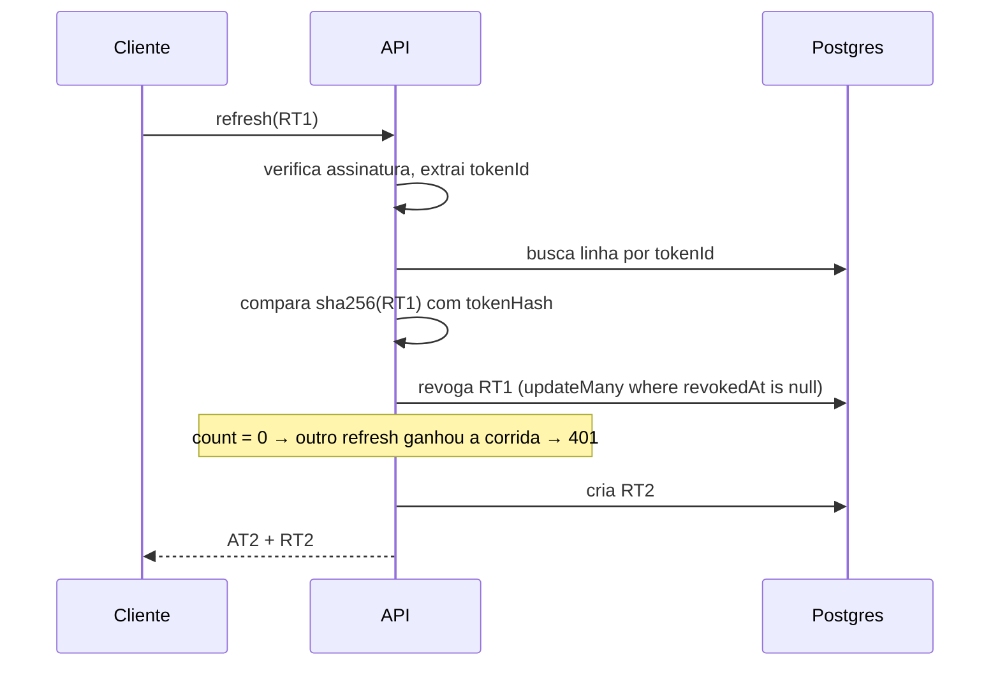

**Status:** Aceita
**Data:** 2026-08-31

## Contexto

Até aqui a sessão era mock no front: `localStorage`, senha em texto puro, sem token e
sem expiração (ver `apps/web/src/lib/auth.ts`). O backend precisava de uma estratégia
real antes de qualquer tela deixar de ser placeholder.

Restrições do projeto hoje: sem Redis, sem serviço de sessão, um único processo Fastify,
e o front é SPA servida em origem diferente da API.

## Decisão

**Dois tokens JWT com papéis distintos**, e o refresh rotacionando a cada uso.

| Token | Vida | Segredo | Guardado no banco | Papel |
| --- | --- | --- | --- | --- |
| Access | `JWT_ACCESS_EXPIRES_IN` (15m) | `JWT_SECRET` | não | autoriza requests |
| Refresh | `JWT_REFRESH_EXPIRES_IN` (7d) | `JWT_REFRESH_SECRET` | sim, como hash | troca por um par novo |

O access token é stateless: `createContext` valida a assinatura e monta
`context.auth` sem tocar no banco. O refresh é stateful — cada um tem uma linha em
`refresh_token`, o que permite revogar.

**O elo que amarra os dois:** o `tokenId` que vai dentro do payload do refresh é
o **id da linha** no banco.

```ts
const tokenId = generateTokenId();
const refreshToken = await generateRefreshTokenPayload(authUser, tokenId);

await authRepository.createRefreshToken({
  id: tokenId,                        // ← mesma chave que vai no JWT
  userId: user.id,
  tokenHash: hashToken(refreshToken),
  expiresAt: /* ... */,
});
```

Sem isso o Prisma gera um uuid próprio, `findRefreshTokenById(payload.tokenId)` nunca
acha a linha, e refresh e logout falham em 100% dos casos. Foi exatamente o bug da
primeira implementação. Um teste trava a invariante.

### Fluxo de rotação



### Replay

Refresh já rotacionado que reaparece significa que vazou. A resposta não é só recusar:

```ts
if (storedToken.revokedAt) {
  await authRepository.revokeAllRefreshTokensForUser(storedToken.userId);
  throw new InvalidRefreshTokenError();
}
```

Toda a família de tokens do usuário cai. Quem roubou perde o acesso, e o dono é forçado
a logar de novo — sinal visível de que algo aconteceu.

Verificado ponta a ponta contra o banco real:

```
refresh (rotaciona)        : token novo != antigo
replay do token rotacionado: HTTP 401
novo token apos replay     : HTTP 401 (familia revogada)
```

## Consequências

**Logout é de verdade.** Revoga a linha do refresh. O access token continua válido até
expirar — janela de no máximo 15 minutos, o preço de não consultar o banco a cada request.

**Revogar sessão exige o refresh token.** Não há "derrubar todas as sessões" por usuário
exposto na API hoje; a função existe no repository
(`revokeAllRefreshTokensForUser`) mas só é chamada na detecção de replay.

**A tabela `refresh_token` cresce.** Nada apaga linha revogada ou expirada. Precisa de
uma rotina de limpeza antes de produção — hoje é dívida conhecida, não resolvida.

**Dois segredos para gerenciar.** `JWT_SECRET` e `JWT_REFRESH_SECRET` são distintos de
propósito: access token roubado não pode ser forjado em refresh. Ambos obrigatórios em
`packages/env/src/server.ts`.

**Tokens vão no corpo da resposta, não em cookie.** O front guarda e envia
`Authorization: Bearer`. Escolha do estado atual, não recomendação final — cookie
`httpOnly` + `SameSite` protegeria contra XSS, e o CORS já está configurado com
`credentials: true` para sustentar essa troca. Candidato a ADR própria.

**Não há rate limiting.** `login`, `register` e `refresh` aceitam tentativas ilimitadas.
Pendência aberta e conhecida.

## Alternativas consideradas

**Sessão em banco com cookie opaco.** Revogação instantânea e nada de janela de 15
minutos. Descartada: exige consulta ao banco em toda request autenticada, e o access
token stateless resolve o caso comum sem I/O.

**Só access token, sem refresh.** Descartada: ou a vida é curta e o usuário deslogado
o tempo todo, ou é longa e não há revogação possível.

**Refresh de vida longa sem rotação.** Descartada: um token vazado vale sete dias e não
há como perceber o vazamento. A rotação é justamente o que torna o replay detectável.

**Redis para a lista de tokens.** Descartada por ora: adiciona infraestrutura para um
volume que o Postgres absorve sem esforço. Reavaliar se a tabela virar gargalo.
