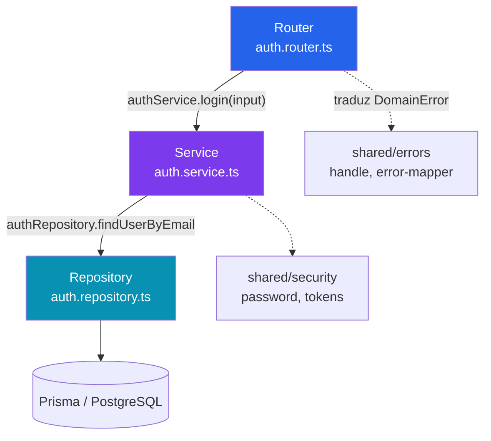
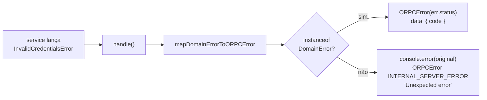
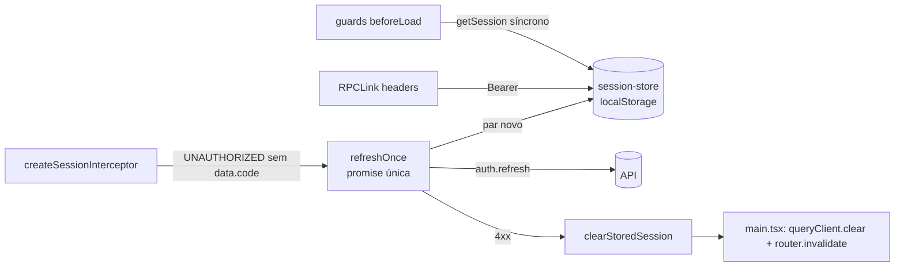

# Componentes internos

Nível 3 do modelo C4. Detalha a organização interna de `packages/api`, que é onde a
lógica do backend vive. `apps/server` não aparece aqui porque não tem componentes —
é só o host HTTP.

## packages/api

```
packages/api/src/
├── index.ts                 # procedures base: public, protected, admin
├── routers/index.ts         # appRouter — junta os routers de cada módulo
├── modules/
│   └── auth/
│       ├── auth.router.ts       # transporte  — oRPC
│       ├── auth.service.ts      # negócio     — regras
│       ├── auth.repository.ts   # dados       — Prisma
│       ├── auth.schema.ts       # Zod de input/output
│       ├── auth.mapper.ts       # User (Prisma) → AuthUser / PublicUser
│       ├── auth.errors.ts       # erros de domínio do módulo
│       ├── auth.tokens.ts       # JWT de access e refresh
│       └── index.ts             # barrel
│   └── meetings/                # Modo Reunião — adminProcedure nas sete rotas
│       ├── meetings.router.ts
│       ├── meetings.service.ts      # presença em transação única, reunião imutável
│       ├── meetings.repository.ts   # Prisma, inclusive escrita em kpi_assignment
│       ├── meetings.schema.ts
│       ├── meetings.mapper.ts       # closedAt → status OPEN/CLOSED
│       ├── meetings.errors.ts
│       └── index.ts
│   └── ranking/                 # GET /ranking — janelas, snapshot e change
│       ├── ranking.service.ts       # materialização preguiçosa de ranking_snapshot
│       ├── ranking.repository.ts    # agregação por janela + snapshot
│       └── ...                      # router, schema, mapper, errors, index
│   └── dashboard/               # GET /dashboard/member e /dashboard/admin
│       ├── dashboard.service.ts     # monta os agregados com rank() e levelFor()
│       ├── dashboard.repository.ts  # contagens, somas e listagens próprias
│       └── ...                      # router, schema, mapper, errors, index
├── shared/
│   ├── context.ts           # createContext — Bearer → context.auth, confere active no banco
│   ├── errors/
│   │   ├── domain-error.ts  # classe base, carrega code e status
│   │   ├── error-mapper.ts  # DomainError → ORPCError
│   │   ├── handle.ts        # wrapper usado por qualquer router
│   │   ├── common.errors.ts # erros usados por mais de um módulo
│   │   └── index.ts
│   ├── schemas/             # Zod compartilhado: categoria, nível, atribuição, query
│   ├── guards/              # assertMembersActive — assignments e meetings
│   ├── email/               # normalizeEmail — auth e members
│   ├── mappers/
│   │   └── kpi-assignment.ts # KpiAssignment e histórico com user
│   ├── security/
│   │   ├── password.ts      # bcrypt + DUMMY_PASSWORD_HASH
│   │   ├── access-token.ts  # assina e valida o access token (typ, role, email)
│   │   ├── session.repository.ts # status e role atuais do usuário para o contexto
│   │   └── tokens.ts        # JWT genérico, sha256, timingSafeEqual, durações
│   ├── time/
│   │   └── timezone.ts      # TIMEZONE America/Sao_Paulo, dayStart/dayEnd/dayOf
│   ├── ranking/
│   │   ├── rank.ts          # ordenação, desempate em três níveis, posição sequencial
│   │   └── periods.ts       # windowOf / previousWindow — semana ISO, mês, trimestre
│   └── gamification/
│       └── levels.ts        # 21 limiares, faixas, levelFor — saiu de profile na 3D
└── tests/
    ├── modules/auth/        # router, service e tokens
    ├── modules/meetings/    # router e service
    ├── modules/ranking/     # router e service
    ├── modules/dashboard/   # router e service
    └── shared/              # error-mapper, password, ranking, gamification
```

Os demais módulos (`members`, `kpis`, `assignments`, `profile`) seguem o mesmo formato de
sete arquivos — ver `docs/modules/<nome>.md` para as regras de cada um.

### Regras puras em `shared/`

Quatro regras saíram de módulo para `shared/` na Fase 3, todas pelo mesmo motivo: dois
módulos precisam da mesma regra e módulo não importa módulo. Nenhuma fala com Prisma —
quem carrega a linha é o repository de cada módulo.

| Regra | Arquivo | Consumidores |
| --- | --- | --- |
| Fuso e dia de calendário | `shared/time/timezone.ts` | ranking, assignments, profile |
| Janelas de calendário | `shared/ranking/periods.ts` | ranking, dashboard, profile |
| Ordenação do ranking | `shared/ranking/rank.ts` | ranking, dashboard, profile |
| Níveis | `shared/gamification/levels.ts` | profile, dashboard |
| Linha agregada → linha do ranking | `shared/ranking/rank.ts` (`toRankableRow`) | ranking, dashboard |

Além das regras, contrato repetido também mora em `shared/`: `kpiCategorySchema`,
`levelSchema`, os schemas de atribuição e os preprocessadores de query em
`shared/schemas/`; `mapKpiAssignment` e `mapAssignmentHistoryItem` em `shared/mappers/`;
`KpiNotFoundError`, `KpiInactiveError`, `MemberNotFoundError` e `MemberInactiveError` em
`shared/errors/common.errors.ts`. O `MemberInactiveError` do dashboard continua no
módulo: é outro significado (403, "sem dashboard"), não o 409 de atribuição.

## Camadas



Cada camada conhece **apenas** a de baixo. Razão e alternativas em
[ADR 0009](http://localhost:4000/docs/adr/0009-camadas-router-service-repository).

| Camada | Pode importar | Não pode |
| --- | --- | --- |
| Router | service, schema, `shared/errors` | Prisma, repository |
| Service | repository, mapper, errors, tokens, `shared/security` | Prisma, oRPC |
| Repository | `@kpi-corp/db` | service, router |
| `shared/*` | outros `shared/*` | qualquer coisa em `modules/` |

A última linha é a que mais escorrega. `shared/` importando de `modules/` inverte a
dependência e foi um defeito real corrigido na ADR 0010 — `shared/context.ts` é a única
exceção tolerada hoje, porque precisa de `verifyAccessToken` do auth.

## Procedures base

`packages/api/src/index.ts` define três níveis de acesso, cada um construído sobre o
anterior:

| Procedure | Garante | Erro se falhar |
| --- | --- | --- |
| `publicProcedure` | nada | — |
| `protectedProcedure` | `context.auth` não é nulo | `ORPCError("UNAUTHORIZED")` → 401 |
| `adminProcedure` | `context.auth.role === "ADMIN"` | `ORPCError("FORBIDDEN")` → 403 |

```ts
export const protectedProcedure = o.use(({ context, next }) => {
  if (!context.auth) {
    throw new ORPCError("UNAUTHORIZED", { message: "Unauthorized" });
  }

  return next({ context: { ...context, auth: context.auth } });
});
```

O `next({ context: { ...context, auth: context.auth } })` é o que estreita o tipo: dentro
do handler, `context.auth` deixa de ser `T | null`. Guard de perfil vai aqui, nunca dentro
do handler.

## Tratamento de erro



O erro carrega o próprio status (`readonly status = "UNAUTHORIZED"`), então o mapper não
precisa conhecer módulo nenhum. Detalhes em
[ADR 0010](http://localhost:4000/docs/adr/0010-erros-de-dominio).

`handle` mora em `shared/errors/handle.ts` e vale para qualquer router futuro:

```ts
login: publicProcedure
  .input(loginInputSchema)
  .output(loginResponseSchema)
  .handler(({ input }) => handle(() => authService.login(input))),
```

## Contexto da request

`shared/context.ts` roda antes de todo handler:

```ts
const token = authHeader.startsWith("Bearer ") ? authHeader.slice(7) : null;
// verifica assinatura; token inválido vira auth: null, não exceção
```

Token ausente, expirado ou com assinatura errada resultam todos em `auth: null`. Quem
decide se isso é erro é a procedure, não o contexto.

## Sessão no front

O consumidor do contexto acima é `apps/web`. Decisão em
[ADR 0014](http://localhost:4000/docs/adr/0014-sessao-no-cliente).



| Arquivo | Papel |
| --- | --- |
| `lib/session-store.ts` | Único dono da chave `kpicorp.session` |
| `lib/refresh.ts` | Rotação deduplicada e retry 1× |
| `lib/auth.ts` | `signIn`, `signOut`, `getSession`, `syncSessionUser` |
| `lib/invite.ts` | `validateInvite`, `acceptInvite` |
| `lib/use-revalidated-session.ts` | `auth.me` em segundo plano nos layouts |

## Como adicionar um módulo

1. `packages/api/src/modules/<nome>/` com os sete arquivos do padrão do auth.
2. Erros do módulo estendendo `DomainError`, com `code` e `status`.
3. Router usando `handle()` de `shared/errors`.
4. Registrar em `packages/api/src/routers/index.ts`.
5. Testes em `src/tests/modules/<nome>/` — service com repository mockado, router com service mockado.

Nada em `shared/` precisa mudar para acomodar um módulo novo. Se precisar, provavelmente
a dependência está invertida.

## Testes

| Arquivo | O que cobre | Mocka |
| --- | --- | --- |
| `tests/modules/auth/service.test.ts` | regra de negócio | `authRepository` inteiro |
| `tests/modules/auth/router.test.ts` | contrato HTTP e tradução de erro | `authService` inteiro |
| `tests/modules/auth/tokens.test.ts` | JWT, sha256, comparação | nada |
| `tests/modules/meetings/service.test.ts` | regras e transações do Modo Reunião | `meetingsRepository` inteiro |
| `tests/modules/meetings/router.test.ts` | contrato e autorização das sete rotas | `meetingsService` inteiro |
| `tests/modules/ranking/*.test.ts` | janelas, snapshot, `change`, `quarter` só Admin | repository / service |
| `tests/modules/dashboard/*.test.ts` | blocos, janelas, 30 dias, autorização | repository / service |
| `tests/modules/assignments/*.test.ts` | revogação, histórico paginado, filtros e datas | repository / service |
| `tests/modules/profile/badges.test.ts` | as dez badges, puras | nada |
| `tests/shared/ranking/*.test.ts` | `rank` e `periods` | nada |
| `tests/shared/gamification/levels.test.ts` | limiares e faixas | nada |
| `tests/shared/errors/error-mapper.test.ts` | status por erro, vazamento | nada |
| `tests/shared/security/password.test.ts` | bcrypt e o hash dummy | nada |

509 testes em 25 arquivos, nenhum precisa de banco. `npm run test` da raiz.
