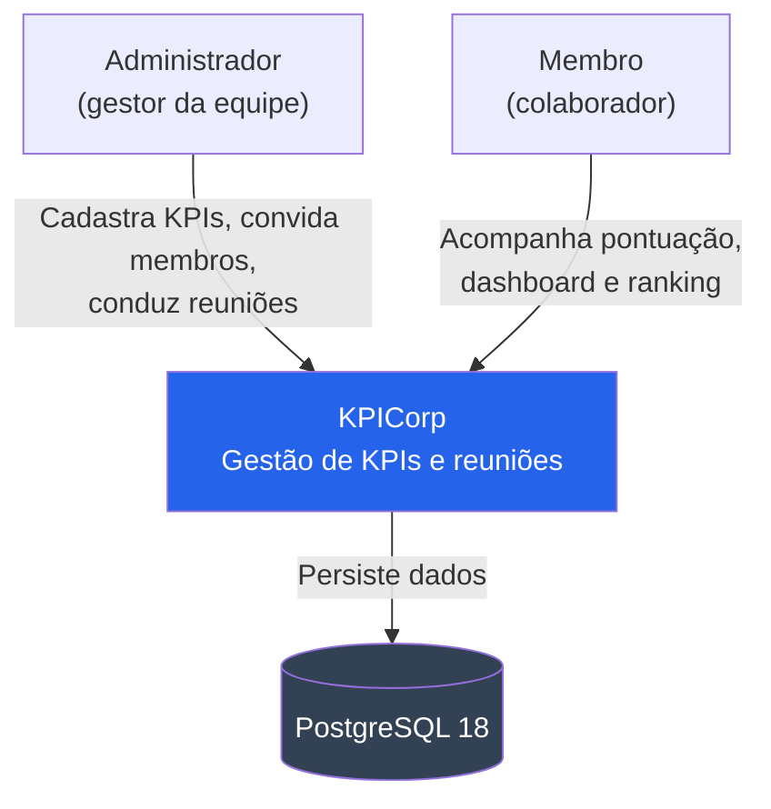
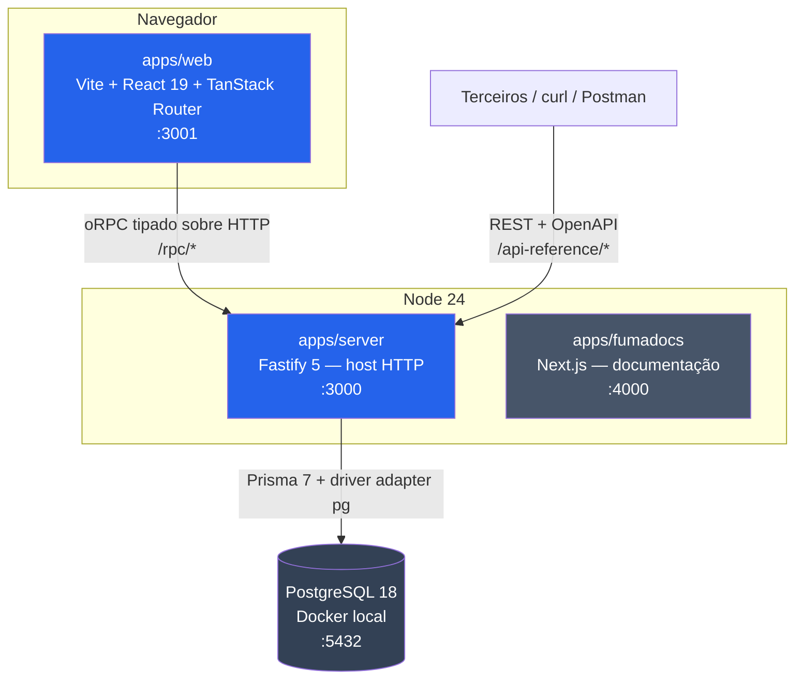
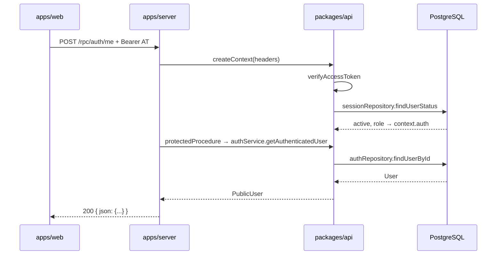

# Visão geral da arquitetura

KPICorp é um sistema de acompanhamento de KPIs de equipe: o administrador cadastra
indicadores, atribui pontuação aos membros durante reuniões, e o time acompanha
dashboard e ranking.

Este documento cobre os níveis 1 (Contexto) e 2 (Container) do modelo C4. O nível 3
está em [COMPONENTS.md](COMPONENTS.md).

## Nível 1 — Contexto

### Atores

| Ator | Perfil | O que faz |
| --- | --- | --- |
| Administrador | `ADMIN` | Cadastra e edita KPIs, convida membros, cria reuniões, atribui pontuação |
| Membro | `MEMBER` | Consulta o próprio dashboard, histórico de pontuação e ranking da equipe |

### Sistemas externos

**Nenhum hoje.** Não há gateway de pagamento, provedor de e-mail, SSO ou serviço de
terceiros. O convite é gerado como token e o link é entregue fora do sistema — quando
existir envio de e-mail, este diagrama muda.

## Nível 2 — Container

### Containers

| Container | Stack | Porta | Responsabilidade |
| --- | --- | --- | --- |
| `apps/web` | Vite, React 19, TanStack Router, TailwindCSS v4 | 3001 | Interface. Consome a API pelo client oRPC tipado, sem `fetch` manual |
| `apps/server` | Fastify 5, Node 24, ESM | 3000 | **Só host HTTP.** CORS, montagem dos handlers oRPC, `listen`. Sem regra de negócio |
| `apps/fumadocs` | Next.js, Fumadocs | 4000 | Documentação de engenharia e ADRs |
| PostgreSQL | Postgres 18 em Docker | 5432 | Persistência |

### Pacotes compartilhados

Não são containers — são bibliotecas de código consumidas em build time.

| Pacote | Papel |
| --- | --- |
| `packages/api` | **Onde a API vive de verdade.** Routers, services e repositories oRPC. Fonte da verdade dos tipos |
| `packages/db` | Schema Prisma, migrations, client singleton, seed, docker-compose |
| `packages/env` | Schemas de variável de ambiente validados com Zod em runtime |
| `packages/ui` | Primitives shadcn/ui sobre Base UI, compartilhados pelos apps React |
| `packages/config` | `tsconfig.base.json` |

### Comunicação

O mesmo `appRouter` de `packages/api` é montado **duas vezes** em `apps/server`:

| Prefixo | Protocolo | Consumidor | Formato |
| --- | --- | --- | --- |
| `/rpc/*` | oRPC | o próprio front, via client tipado | `{"json": ...}` — preserva `Date`, `Map`, `BigInt` |
| `/api-reference/*` | OpenAPI / REST | terceiros, curl, Postman | JSON puro |

Mesmos handlers, mesma validação Zod, dois transportes. Procedure nova aparece nos dois
automaticamente — não há registro manual. Detalhes em
[ADR 0001](http://localhost:4000/docs/adr/0001-backend-fastify-orpc).

### Autenticação entre containers

O front envia `Authorization: Bearer <accessToken>`. `createContext` valida a assinatura
do JWT e confere no banco (`sessionRepository.findUserStatus`) se o usuário segue ativo e
qual é o perfil atual — token válido de conta desativada vira `auth: null`. Com isso monta
`context.auth`; `protectedProcedure` recusa a request quando ele é nulo.

Estratégia completa (dois tokens, rotação, detecção de replay) em
[ADR 0011](http://localhost:4000/docs/adr/0011-jwt-refresh-token-rotativo) e em
[docs/modules/auth.md](../modules/auth.md).

## Fluxo de uma request autenticada

## Estado atual

| Área | Situação |
| --- | --- |
| Auth (login, register, refresh, logout, me) | Implementado e testado ponta a ponta |
| Demais módulos da API | `members`, `kpis`, `assignments`, `profile`, `meetings`, `ranking` e `dashboard` implementados — roadmap do MVP fechado (Fases 1 a 3) |
| Front | Todas as telas consomem a API (auth, membros, KPIs, ranking, painel e modo reunião do admin, painel do membro). O que falta está em [pendencias-api.md](../pendencias-api.md) |
| Deploy | Não existe. Só ambiente de desenvolvimento local |

## Onde continuar

- [Componentes internos (C4 nível 3)](COMPONENTS.md)
- [Decisões de arquitetura (ADR)](decisions/README.md)
- [Módulo de autenticação](../modules/auth.md)
- Demais módulos: [members](../modules/members.md), [kpis](../modules/kpis.md),
  [assignments](../modules/assignments.md), [profile](../modules/profile.md),
  [meetings](../modules/meetings.md), [ranking](../modules/ranking.md),
  [dashboard](../modules/dashboard.md)
