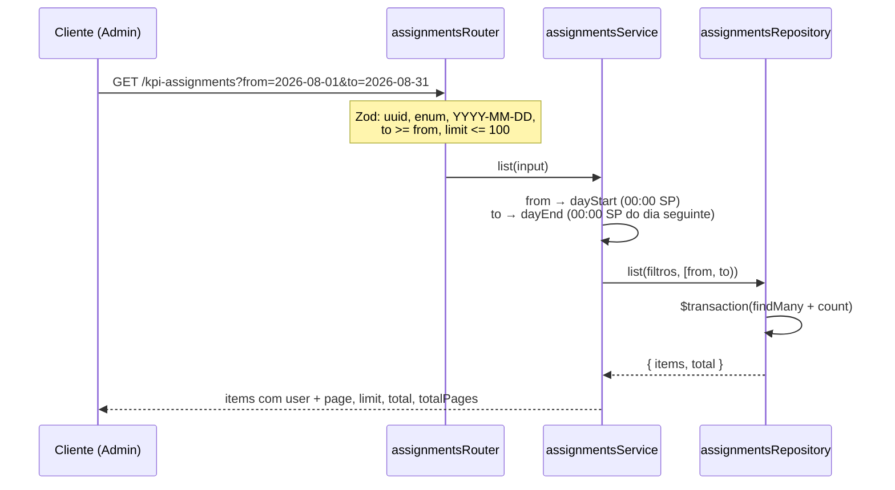

# Módulo: Assignments

## Objetivo

A atribuição de KPI a membros e o histórico dessas atribuições. Todas as rotas são
`adminProcedure`: atribuir, revogar e auditar são exclusivos do Admin (roadmap § 1.5).
Cobre a entrega 2B (atribuir, em massa, listar por membro, revogar) e a 3C (histórico
geral paginado).

Código em `packages/api/src/modules/assignments/`.

## Regras de negócio

### Atribuição (2B)

| # | Regra |
| --- | --- |
| RN01 | A atribuição **congela** o `points` do KPI no instante em que é criada. Reprecificar o KPI depois não reescreve o passado |
| RN02 | `assignedBy` vem do contexto autenticado, nunca do corpo |
| RN03 | KPI inexistente → 404 `KPI_NOT_FOUND`; KPI inativo → 409 `KPI_INACTIVE`. Membro inexistente → 404 `MEMBER_NOT_FOUND`; membro inativo → 409 `MEMBER_INACTIVE` |
| RN04 | Atribuição em massa é **tudo ou nada**: valida KPI e todos os membros (numa consulta só) e cria as linhas **na mesma transação**. `userIds` duplicados ou mais de 200 são rejeitados no schema (400) |
| RN05 | O mesmo KPI pode ser atribuído várias vezes ao mesmo membro — reconhecimento é evento, não estado |
| RN06 | Revogar é preencher `revokedAt`, não apagar a linha: `DELETE /kpi-assignments/{id}` responde a atribuição revogada. Inexistente → 404 `ASSIGNMENT_NOT_FOUND`; já revogada → 409 `ASSIGNMENT_ALREADY_REVOKED`, inclusive para a segunda de duas revogações simultâneas (`updateMany` guardado por `revokedAt IS NULL`) |
| RN07 | Revogação vale inclusive para atribuição feita em reunião encerrada — encerrar congela o que entra, não a correção de erro |
| RN08 | `GET /members/{id}/kpi-assignments` lista o histórico de um membro, decrescente por `assignedAt`, com filtros `category` e `revoked`, **sem paginação**. Membro sem atribuição → lista vazia |

### Histórico geral (3C)

| # | Regra |
| --- | --- |
| RN09 | `GET /kpi-assignments` lista as atribuições de toda a equipe, paginado no shape de `GET /members`: `items`, `page`, `limit`, `total`, `totalPages`. `page` padrão 1, `limit` padrão 20, teto 100 |
| RN10 | Cada linha estende a atribuição da 2B com `user: { id, name, position }`, `assigner: { id, name }` (quem atribuiu) e `meeting: { id, title } \| null` (reunião de origem; `null` para avulsa). O schema base (`kpiAssignmentSchema`) fica intacto — `POST` e `/bulk` não pagam join para devolver um nome que a tela já tem. O mesmo shape alimenta `recentAssignments` do dashboard |
| RN11 | Filtros opcionais e combináveis: `userId`, `kpiId`, `category`, `from`, `to`, `revoked`. Sem `revoked`, vêm válidas **e** revogadas — esconder revogação numa rota de auditoria esconderia o que ela existe para mostrar |
| RN12 | `from` e `to` são dias `YYYY-MM-DD` **inclusivos nas duas pontas** em `America/Sao_Paulo`: `assignedAt >= dayStart(from)` e `assignedAt < dayEnd(to)` de `shared/time`. Atribuição às 23h59 do `to` aparece. `to` anterior a `from` → 400; data inexistente (`2026-02-30`) → 400 |
| RN13 | Ordenação `assignedAt` DESC com desempate por `id` DESC — sem o segundo critério, duas atribuições em massa no mesmo instante trocariam de página entre requisições |
| RN14 | `userId` de membro inexistente devolve lista vazia com `total: 0`, não 404 — é filtro, não recurso |
| RN15 | `totalPages` tem mínimo 1, mesma fórmula de `GET /members` e `GET /meetings`; página além do fim devolve `items: []`, não erro |

## Fluxos

### Histórico geral

## Endpoints

| Método | Rota | Descrição | Auth | Erros |
| --- | --- | --- | --- | --- |
| POST | `/kpi-assignments` | Atribuir um KPI a um membro | ADMIN | 400, 401, 403, 404, 409 |
| POST | `/kpi-assignments/bulk` | Atribuir um KPI a vários membros, tudo ou nada | ADMIN | 400, 401, 403, 404, 409 |
| GET | `/kpi-assignments` | Histórico geral paginado e filtrável | ADMIN | 400, 401, 403 |
| GET | `/members/{id}/kpi-assignments` | Histórico de um membro | ADMIN | 400, 401, 403 |
| DELETE | `/kpi-assignments/{id}` | Revogar (preenche `revokedAt`) | ADMIN | 401, 403, 404, 409 |

Collection Postman: pasta `KPI Assignments (2B)`, incluindo `Histórico de atribuições
(3C)`.

## Decisões relacionadas

| Documento | Assunto |
| --- | --- |
| [Spec 2B](../specs/fase-2b-atribuicoes.md) | Congelamento de pontos, revogação, massa |
| [Spec 3C](../specs/fase-3c-historico-de-atribuicoes.md) | Histórico geral, filtros e datas |

## Consequências registradas

- Duas rotas de histórico convivem: a de um membro (sem paginação, sem `user`) e a geral
  (paginada, com `user`). A diferença é intencional.
- Não há índice em `assignedAt`; é a primeira coisa a olhar se a auditoria ficar lenta.
- Sem filtro `meetingId`: o dado já vem em `GET /meetings/{id}`.
- Nenhuma tela do front consome o histórico ainda — o feed de `activity-feed.ts` segue no
  mock.
