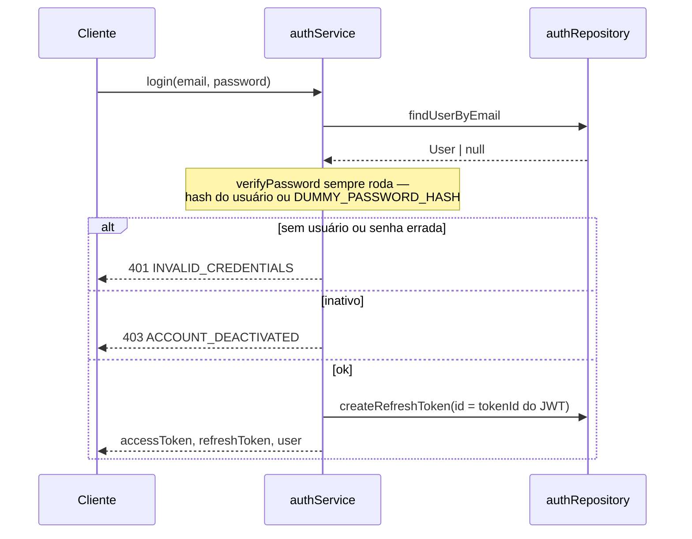
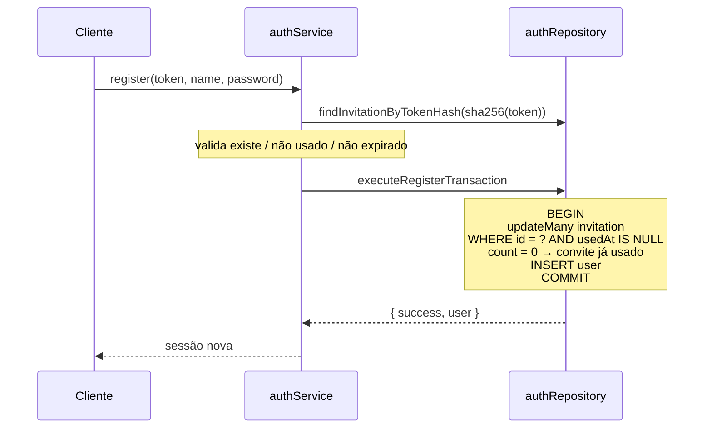
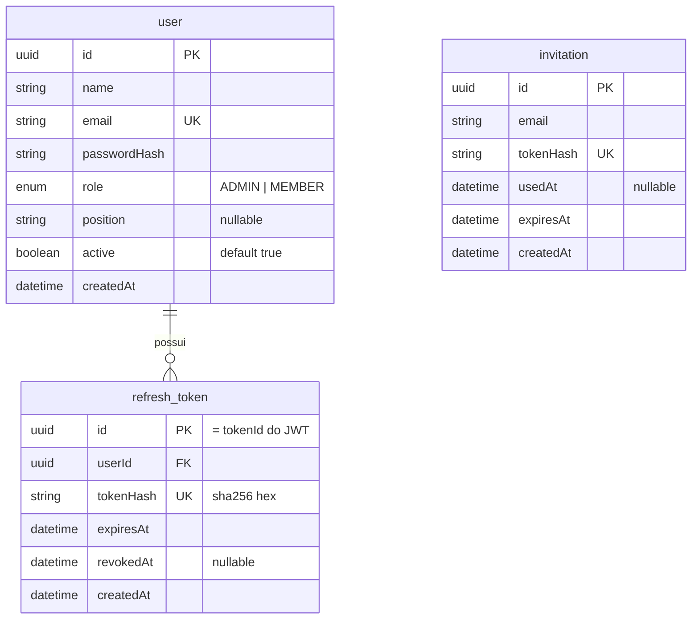

# Módulo: Auth

## Objetivo

Autenticação e sessão do KPICorp: login por e-mail e senha, cadastro por convite,
renovação de sessão e logout. É o único módulo da API implementado hoje.

Código em `packages/api/src/modules/auth/`.

## Regras de negócio

| # | Regra |
| --- | --- |
| RN01 | E-mail inexistente e senha errada produzem **a mesma** resposta: 401 `"Invalid email or password"`. O e-mail é normalizado (trim + minúsculas) antes da busca, como no convite |
| RN02 | A verificação de senha roda sempre, mesmo sem usuário, contra um hash dummy — o tempo de resposta não revela se o e-mail existe |
| RN03 | Usuário com `active = false` não faz login: 403 `ACCOUNT_DEACTIVATED` |
| RN04 | Cadastro exige convite válido: token existente, não usado e não expirado. O banco guarda só o SHA-256 do token (`invitation.tokenHash`) e a busca é pelo hash |
| RN05 | O convite é consumido atomicamente — duas requisições simultâneas com o mesmo token, só uma cria conta |
| RN06 | O e-mail da conta vem **do convite**, nunca do formulário |
| RN07 | O perfil de quem se cadastra por convite é sempre `MEMBER`, fixado no servidor |
| RN08 | Cada refresh rotaciona: o token usado é revogado e um novo par é emitido |
| RN09 | Refresh já revogado que reaparece revoga **todos** os tokens do usuário (replay) |
| RN10 | Logout revoga o refresh token; o access token segue válido até expirar (máx. 15 min). Desativação corta antes: o contexto confere `active` no banco a cada requisição |
| RN11 | Refresh token é guardado como hash, nunca em texto puro |
| RN12 | Validar convite não o consome e só revela o e-mail quando ele vale |

## Fluxos

### Login



### Cadastro por convite



O `updateMany` guardado por `usedAt: null` dentro da transação é o que fecha a corrida.
Checar `usedAt` antes da transação e marcar dentro dela deixaria duas requisições
passarem pela checagem antes de qualquer commit.

### Validação de convite

`validateInvite(token)` busca pelo SHA-256 do token e responde com a mesma ordem de
checagem do `register`: inexistente → `INVALID`, usado → `USED`, vencido → `EXPIRED`.
Só `VALID` devolve o e-mail — recusa não diz para quem o link foi emitido. Não consome o
convite; quem queima é o `register`.

```json
{ "status": "VALID", "email": "novo@kpicorp.com" }
{ "status": "EXPIRED" }
```

### Refresh e replay

Descrito em detalhe na
[ADR 0011](http://localhost:4000/docs/adr/0011-jwt-refresh-token-rotativo).

O ponto crítico: o `tokenId` dentro do JWT **é** o id da linha em `refresh_token`.

```ts
const tokenId = generateTokenId();
const refreshToken = await generateRefreshTokenPayload(authUser, tokenId);

await authRepository.createRefreshToken({
  id: tokenId,   // sem isto, o Prisma gera outro id e o refresh nunca acha a linha
  userId: user.id,
  tokenHash: hashToken(refreshToken),
  expiresAt: new Date(Date.now() + durationToMs(env.JWT_REFRESH_EXPIRES_IN)),
});
```

## Modelo de dados



`invitation` não tem FK para `user` de propósito: o convite existe antes da conta.

Schemas em `packages/db/prisma/schema/{user,refresh-token,invitation}.prisma`.

## Endpoints

Prefixo `/rpc` para o client tipado, `/api-reference` para REST/OpenAPI.

| Método | Rota | Descrição | Auth | Erros |
| --- | --- | --- | --- | --- |
| POST | `/auth/login` | E-mail e senha → sessão | — | 401 `INVALID_CREDENTIALS`, 403 `ACCOUNT_DEACTIVATED` |
| POST | `/auth/validateInvite` | Diz se o convite vale, sem consumir | — | nenhum; recusa vem como `status` |
| POST | `/auth/register` | Convite → conta + sessão | — | 401 `INVALID_INVITATION`, 401 `INVITATION_EXPIRED`, 409 `INVITATION_ALREADY_USED`, 409 `EMAIL_ALREADY_REGISTERED` |
| POST | `/auth/refresh` | Rotaciona a sessão | refresh token no corpo | 401 `INVALID_REFRESH_TOKEN`, 403 `ACCOUNT_DEACTIVATED` |
| POST | `/auth/logout` | Revoga o refresh token | — | nenhum, sempre `{ success: true }` |
| GET | `/auth/me` | Usuário da sessão | `Bearer` | 401 |

O `code` do erro vai em `data.code` na resposta — ramifique por ele, não pela mensagem.

Referência gerada a partir do Zod: `http://localhost:3000/api-reference`.

### Exemplo

```bash
curl -s -X POST http://localhost:3000/rpc/auth/login \
  -H 'Content-Type: application/json' \
  -d '{"json":{"email":"admin@kpicorp.com","password":"admin123"}}'
```

```bash
curl -s -X GET http://localhost:3000/rpc/auth/me \
  -H "Authorization: Bearer $ACCESS_TOKEN"
```

Credenciais de desenvolvimento vêm do seed (`npm run db:seed`): `admin@kpicorp.com` /
`admin123`, e três membros com `member123`.

## Decisões relacionadas

| ADR | Assunto |
| --- | --- |
| [0009](http://localhost:4000/docs/adr/0009-camadas-router-service-repository) | Camadas Router, Service e Repository |
| [0010](http://localhost:4000/docs/adr/0010-erros-de-dominio) | Erros de domínio desacoplados do oRPC |
| [0011](http://localhost:4000/docs/adr/0011-jwt-refresh-token-rotativo) | JWT com refresh token rotativo |
| [0012](http://localhost:4000/docs/adr/0012-hash-de-senha-e-de-token) | bcrypt para senha, SHA-256 para refresh token |
| [0013](http://localhost:4000/docs/adr/0013-ids-em-uuid) | Identificadores em UUID |

## Dependências

- `packages/db` — Prisma, acessado só pelo repository
- `packages/env` — `JWT_SECRET`, `JWT_REFRESH_SECRET`, `JWT_ACCESS_EXPIRES_IN`, `JWT_REFRESH_EXPIRES_IN`
- `packages/api/src/shared/` — `handle`, `DomainError`, `password`, `tokens`
- `bcryptjs` para senha, `jose` para JWT

Nenhum módulo depende do auth hoje. `shared/context.ts` importa `verifyAccessToken`
dele — a única dependência de `shared/` para `modules/` no projeto.

## Pendências conhecidas

| Item | Situação |
| --- | --- |
| Rate limiting em `login`, `register` e `refresh` | Não existe. Tentativas ilimitadas |
| Limpeza de `refresh_token` revogado/expirado | Nenhuma rotina; a tabela só cresce |
| Envio de e-mail do convite | Fora de escopo; o link é entregue por fora |
| Troca e recuperação de senha | Não implementado |
| Tokens em cookie `httpOnly` | Hoje vão no corpo e o front guarda em `localStorage` ([ADR 0014](http://localhost:4000/docs/adr/0014-sessao-no-cliente)); CORS já preparado para a troca |
