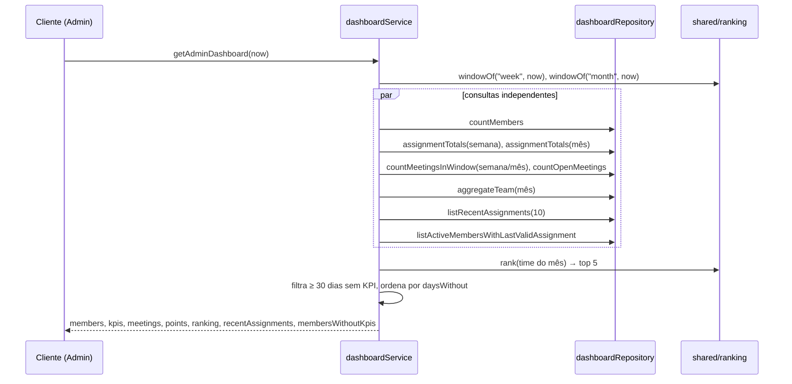

# Módulo: Dashboard

## Objetivo

Os dois agregadores que a tela inicial de cada papel consome: o dashboard do membro e o
dashboard do Admin. Uma requisição, uma resposta — o front não precisa juntar quatro
rotas para desenhar a home. Cobre a entrega 3D da Fase 3.

Código em `packages/api/src/modules/dashboard/`.

## Regras de negócio

| # | Regra |
| --- | --- |
| RN01 | Nada é guardado: sem cache, sem tabela de agregado, sem coluna desnormalizada. Dashboard com número velho é pior do que dashboard lento |
| RN02 | O módulo tem repository próprio e **não** chama `rankingService`, `profileService` nem `assignmentsService`. Usa as regras puras `shared/ranking` (`rank`, `windowOf`) e `shared/gamification` (`levelFor`) sobre linhas que ele mesmo carrega |
| RN03 | `/dashboard/member` é `protectedProcedure`: todo autenticado tem dashboard de membro, ADMIN incluído (PRD § 6) |
| RN04 | `points` e `kpiCount` somam atribuições com `revokedAt IS NULL`, sem filtro de sinal — a mesma pontuação de `/me/score`. `level` é o objeto inteiro de `levelFor`, idêntico ao de `/me/score` |
| RN05 | `rankingPosition` é do período `all` — a posição que o membro carrega como identidade — e `teamSize` é a quantidade de ativos: "4º" sem denominador não diz nada |
| RN06 | `recentKpis` traz as **cinco** últimas atribuições válidas, decrescente. Revogada fica de fora: é vitrine; o histórico com revogação é `/me/kpis` |
| RN07 | Usuário desativado com token válido recebe **403 `ACCOUNT_DEACTIVATED`** — o mesmo erro do login, não o `MEMBER_INACTIVE` (409) de atribuição. Na prática o contexto já derruba a sessão antes (401); este é o segundo muro. Usuário inexistente recebe **404 `MEMBER_NOT_FOUND`** |
| RN08 | `/dashboard/admin` é `adminProcedure`. Contadores de `kpis`, `points` e `meetings` usam a **semana ISO e o mês de calendário correntes** de `shared/ranking/periods.ts` — na segunda de manhã a semana zera. O "mês" do dashboard é o mesmo "mês" do ranking |
| RN09 | `meetings.week` e `meetings.month` contam pela `date` da reunião **por dia de calendário**: `meeting.date` é gravado como meia-noite UTC do dia (3A), então a janela compara com `startDay`/`endDay`, não com os instantes de São Paulo — senão a reunião de segunda cairia na semana anterior. `meetings.open` conta `closedAt IS NULL` |
| RN10 | `ranking` é o top 5 do **mês corrente**, com a entrada da 3B **sem** `change` e **sem** `isMe`. Nenhuma das duas rotas grava `ranking_snapshot` |
| RN11 | `recentAssignments` são as 10 últimas atribuições, válidas **e** revogadas, com `user` embutido — o feed de auditoria do Admin, no shape do histórico da 3C |
| RN12 | `membersWithoutKpis` usa janela **deslizante** de 30 dias corridos — a exceção deliberada: é pergunta sobre tempo passado, e um mês de calendário zeraria o alerta na virada. Entra o ativo cuja última atribuição válida tem 30 dias ou mais; revogada não conta como reconhecimento |
| RN13 | Quem nunca recebeu nada conta desde o `createdAt` da conta: criado ontem não entra, criado há dois meses e nunca reconhecido é o caso mais grave. A lista sai ordenada por `daysWithout` decrescente, com `lastAssignmentAt` (`null` para quem nunca recebeu) |
| RN14 | Equipe vazia responde todos os blocos com zeros e listas vazias, sem erro |

## Fluxos

### Dashboard do Admin

## Endpoints

| Método | Rota | Descrição | Auth | Erros |
| --- | --- | --- | --- | --- |
| GET | `/dashboard/member` | Pontos, contagem, posição geral, nível e KPIs recentes do autenticado | `Bearer` (ADMIN e MEMBER) | 401, 403 `ACCOUNT_DEACTIVATED`, 404 `MEMBER_NOT_FOUND` |
| GET | `/dashboard/admin` | Contadores, top 5 do mês, feed e membros sem KPI | `Bearer` (ADMIN) | 401, 403 |

| Bloco do Admin | O que é | Janela |
| --- | --- | --- |
| `members.active` / `.total` | contagem de usuários | — |
| `kpis.week` / `.month` | atribuições válidas criadas | semana ISO / mês corrente |
| `meetings.week` / `.month` | reuniões pela `date` | semana ISO / mês corrente, por dia |
| `meetings.open` | `closedAt IS NULL` | — |
| `points.week` / `.month` | soma de `points` das válidas | semana ISO / mês corrente |
| `ranking` | top 5 | mês corrente |
| `recentAssignments` | últimas 10, válidas e revogadas | — |
| `membersWithoutKpis` | ativos sem atribuição válida | últimos 30 dias corridos |

Collection Postman: pasta `Dashboards (3D)`.

## Pendências

O painel do Admin no front ainda não fecha com o mockup: série de pontos, deltas,
sparklines, pontos totais, top movers, autor e nome da reunião no feed, e o limite de
"esquecido" exposto. Detalhe em [`docs/pendencias-api.md`](../pendencias-api.md)
(DA01 a DA08).

## Decisões relacionadas

| Documento | Assunto |
| --- | --- |
| [Spec 3D](../specs/fase-3d-dashboards.md) | Blocos, janelas e o refactor de níveis |
| [Módulo ranking](ranking.md) | `rank()` e `windowOf()` |

## Consequências registradas

- A regra de níveis saiu de `modules/profile/profile.levels.ts` para
  `shared/gamification/levels.ts`, sem mudar conteúdo nem casos de teste.
- O shape `{ id, name, position, role }` existe em `members`, `profile`, `ranking` e
  `dashboard` — preço de módulo não importar módulo.
- `apps/web/src/lib/dashboard.ts` considera estagnado quem está 7 dias sem KPI; a API
  segue os 30 dias do roadmap. Alinhar é story de web.
- Nenhum dashboard mostra badge nem série temporal; o gráfico de `team-history` segue no
  mock.
