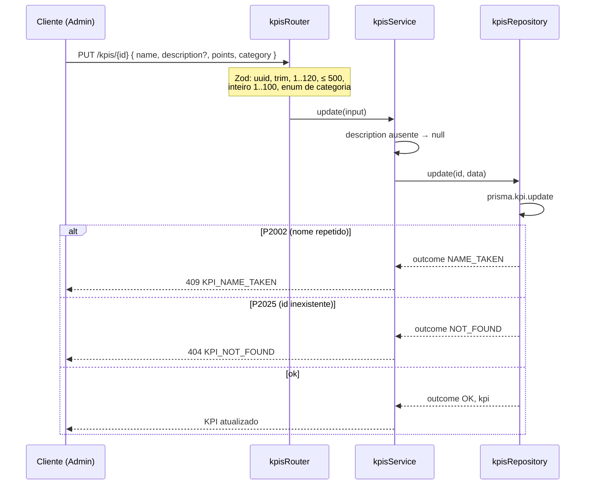

# Módulo: KPIs

## Objetivo

O catálogo de KPIs: o Admin cria, lista, consulta, edita e ativa ou desativa os
indicadores que depois são atribuídos aos membros. Cinco rotas, todas `adminProcedure` —
o roadmap § 1.5 proíbe MEMBER de criar e editar KPI, e nenhuma tela de membro lista o
catálogo. Atribuir não é deste módulo: é de `assignments` (2B) e `meetings` (3A).

Cobre a entrega 2A (roadmap § 2.1).

Código em `packages/api/src/modules/kpis/`.

## Regras de negócio

| # | Regra |
| --- | --- |
| RN01 | Um KPI tem `name`, `description`, `points` e `category`. `name` é obrigatório, com `trim`, de 1 a 120 caracteres; `description` é opcional, com `trim`, até 500 caracteres |
| RN02 | `points` é inteiro de **1 a 100** (`MIN_KPI_POINTS`, `MAX_KPI_POINTS`). O valor chega coagido: `"5"` vale como `5`. Zero, negativo ou fracionário → 400 |
| RN03 | `category` é uma de quatro: `PRESENCE`, `PERFORMANCE`, `BEHAVIOR`, `INITIATIVE`. O enum vive em `shared/schemas/kpi.ts`, compartilhado com atribuição, perfil e dashboard. Fora do enum → 400 |
| RN04 | O nome é único no catálogo (`@unique` em `kpi.name`). Criar ou renomear para um nome já usado → 409 `KPI_NAME_TAKEN`. O repository traduz o `P2002` do Prisma num `outcome`; o service nunca vê o erro do banco. Qualquer outro erro de banco sobe intacto |
| RN05 | `PUT /kpis/{id}` substitui **todos** os campos editáveis: o corpo é o mesmo da criação. `description` omitida vira `null` — editar sem mandar a descrição apaga a descrição |
| RN06 | Editar `points` não reescreve o passado: cada atribuição guarda o `points` do instante em que foi criada (spec 2B). Editar `category` reclassifica o histórico, de propósito — categoria é classificação, não valor negociado |
| RN07 | Não existe `DELETE`. Tirar um KPI de uso é `PATCH /kpis/{id}/status` com `active: false`. KPI inativo não recebe atribuição nova (409 `KPI_INACTIVE`, regra aplicada em `assignments` e `meetings`), mas as atribuições que já tem continuam valendo e contando. Reativar é o mesmo PATCH com `active: true` |
| RN08 | `GET /kpis` **não é paginado**: devolve `items` e `total`. Ordena por `category` e depois por `name`, ambos ascendentes |
| RN09 | Filtros opcionais e combináveis: `category`, `active` e `search` (nome **ou** descrição, sem diferenciar maiúsculas). `active` aceita só `true` ou `false` em texto — `?active=false` vale `false`, não `true`; outro valor → 400. Filtro vazio (`?category=`) vale como ausente. Sem `active`, vêm ativos e inativos |
| RN10 | Cada item da lista traz `uses`: quantas atribuições **válidas** (`revokedAt IS NULL`) usam o KPI. Sem nenhuma, `0`. A contagem é feita na mesma transação da lista |
| RN11 | `GET`, `PUT` e `PATCH` com id inexistente → 404 `KPI_NOT_FOUND`; id que não é UUID → 400. No `PUT` e no `PATCH`, o 404 vem do `P2025` traduzido no repository, sem leitura prévia |
| RN12 | Ativar um KPI já ativo (ou desativar um inativo) não é erro: responde o KPI como está |

## Fluxos

### Edição

`create` e `setStatus` passam pela mesma função `write` do repository e pelo mesmo
`kpiOrThrow` do service — a tradução de erro é uma só para as três escritas.

## Endpoints

| Método | Rota | Procedure | Descrição | Auth | Erros |
| --- | --- | --- | --- | --- | --- |
| POST | `/kpis` | `kpis.create` | Criar KPI | ADMIN | 400, 401, 403, 409 |
| GET | `/kpis` | `kpis.list` | Catálogo filtrável, com `uses` | ADMIN | 400, 401, 403 |
| GET | `/kpis/{id}` | `kpis.getById` | Um KPI | ADMIN | 400, 401, 403, 404 |
| PUT | `/kpis/{id}` | `kpis.update` | Substituir os campos editáveis | ADMIN | 400, 401, 403, 404, 409 |
| PATCH | `/kpis/{id}/status` | `kpis.setStatus` | Ativar ou desativar | ADMIN | 400, 401, 403, 404 |

Anônimo recebe 401 e MEMBER recebe 403 em todas as rotas, sem chegar ao service — há
teste cobrindo as cinco.

### Erros

| Código | HTTP | Quando |
| --- | --- | --- |
| `KPI_NAME_TAKEN` | 409 | `create` ou `update` com nome já usado por outro KPI |
| `KPI_NOT_FOUND` | 404 | `getById`, `update` ou `setStatus` com id inexistente |

`KPI_NOT_FOUND` vive em `shared/errors/common.errors.ts` (assignments e meetings também
lançam); `KPI_NAME_TAKEN`, em `kpis.errors.ts`. `KPI_INACTIVE` é do mesmo arquivo
compartilhado, mas nenhuma rota deste módulo o lança.

## Decisões relacionadas

| Documento | Assunto |
| --- | --- |
| [Roadmap § 2.1](../MVP_API_ROADMAP.md) | Criar, listar, buscar, editar e desativar KPI |
| [Spec 2B](../specs/fase-2b-atribuicoes.md) | Congelamento de `points` na atribuição e regra de KPI inativo — decisões herdadas da 2A |
| [ADR 0015](http://localhost:4000/docs/adr/0015-atribuicao-imutavel-e-revogacao-logica) | Atribuição congela a pontuação e revogar não apaga |
| [Módulo assignments](assignments.md) | Onde `KPI_INACTIVE` é aplicado |
| [Módulo meetings](meetings.md) | KPI de presença: existe, ativo e categoria `PRESENCE` |

A 2A não tem spec: foi implementada antes de o formato existir
([`docs/specs/README.md`](../specs/README.md)).

## Consequências registradas

- O front consome `list`, `create`, `update` e `setStatus` em
  `apps/web/src/pages/admin/kpis/use-kpis.ts`, e `list` no Modo Reunião para escolher o
  KPI de presença. `getById` não tem consumidor.
- O roadmap § 1.5 fala em KPI de pontuação negativa como possibilidade futura. A coluna
  `kpi.points` aceita, mas a API recusa abaixo de 1 — um KPI punitivo exige mudar o schema
  e rever o filtro de histórico do perfil público.
- A unicidade do nome é a do banco: diferencia maiúsculas. `Pontualidade` e
  `pontualidade` convivem.
- A lista não pagina. Com o catálogo do tamanho do seed não pesa; é o primeiro ponto a
  rever se o catálogo crescer.
