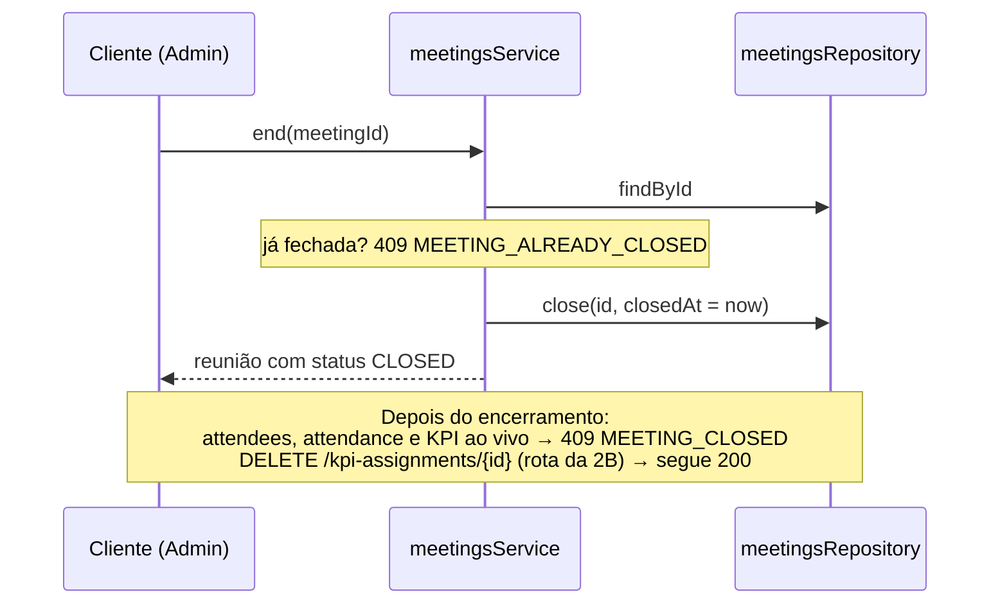

# Módulo: Meetings

## Objetivo

O Modo Reunião: o Admin cria a reunião, escala participantes, registra presença — que
dispara o KPI de presença em massa —, reconhece membros ao vivo, encerra e consulta o
histórico. Sete rotas, todas `adminProcedure`: o roadmap § 1.5 lista criar reuniões e
registrar presença como exclusivas do Admin, e nenhuma tela de membro mostra reunião.

Código em `packages/api/src/modules/meetings/`.

## Regras de negócio

| # | Regra |
| --- | --- |
| RN01 | `createdBy` vem do contexto autenticado, nunca do corpo — um `createdBy` mandado no corpo é ignorado pelo schema, não rejeitado |
| RN02 | O contrato expõe `status: "OPEN" \| "CLOSED"` derivado de `closedAt` no mapper — o booleano `closed` foi substituído pela data, que também responde "quanto durou" e ancora a ordenação do histórico |
| RN03 | Escalado e presente são linhas diferentes no tempo: `POST /attendees` cria com `presentAt = null`; `POST /attendance` carimba `presentAt`. Quem faltou permanece na lista — é o denominador de `PERFECT_MONTH` na 3E |
| RN04 | Marcar presença de quem não foi escalado cria a linha já com `presentAt` — reunião real tem quem aparece sem estar na lista. Não existe rota de desmarcar presença: o caminho é revogar o assignment pela rota da 2B |
| RN05 | O KPI de presença vem no corpo (`kpiId`), validado em três eixos: existe (404 `KPI_NOT_FOUND`), ativo (409 `KPI_INACTIVE`), categoria `PRESENCE` (422 `KPI_NOT_PRESENCE`). A API não escolhe o KPI por convenção — o catálogo semeado tem dois de presença |
| RN06 | Presença é transação única: reunião aberta → KPI válido → membros válidos → upsert de `meeting_attendee` → `createMany` de `kpi_assignment`. Um `userId` inválido no meio da lista derruba a requisição inteira |
| RN07 | Quem já tem `presentAt` é no-op na presença: sai da lista antes da escrita. Clique duplo não dobra pontuação |
| RN08 | Reconhecimento ao vivo (`POST /meetings/{id}/kpi-assignments`) exige `presentAt IS NOT NULL` — 409 `ATTENDEE_NOT_PRESENT` para ausente ou para quem não tem linha de attendee. Qualquer categoria vale, inclusive `PRESENCE` |
| RN09 | Reunião encerrada é imutável: `closedAt` preenchido rejeita attendees, presença, KPI ao vivo e um segundo `end` (409 `MEETING_CLOSED` / `MEETING_ALREADY_CLOSED`). Revogar assignment feito nela continua permitido — encerrar congela o que entra, não a correção de erro |
| RN10 | `points` do assignment de reunião é copiado do KPI no instante da atribuição — reprecificar o KPI depois não reescreve o passado. A regra existe aqui e na 2B (módulo não importa módulo); há teste cobrindo os dois caminhos |
| RN11 | O módulo escreve em `kpi_assignment` pelo próprio repository — `meetings` não importa `assignments`, `kpis`, `members` nem `profile` |
| RN12 | Encerrar reunião sem nenhum presente é permitido — reunião que não aconteceu é fato, não erro. Não existe reabrir: `closedAt` só é preenchido, nunca limpo |

## Fluxos

### Presença em massa

```mermaid
sequenceDiagram
    participant C as Cliente (Admin)
    participant S as meetingsService
    participant R as meetingsRepository

    C->>S: registerAttendance(meetingId, userIds, kpiId)
    S->>R: transaction BEGIN
    S->>R: findById(meetingId)
    Note over S: fechada? 409 MEETING_CLOSED
    S->>R: findKpiById(kpiId)
    Note over S: inexistente? 404 KPI_NOT_FOUND<br/>inativo? 409 KPI_INACTIVE<br/>categoria ≠ PRESENCE? 422 KPI_NOT_PRESENCE
    S->>R: findUsersByIds(userIds)
    Note over S: qualquer inválido/inativo derruba tudo:<br/>404 MEMBER_NOT_FOUND / 409 MEMBER_INACTIVE
    S->>R: findAttendees(meetingId, userIds)
    Note over S: quem já tem presentAt sai da lista —<br/>presença dupla não dobra pontuação
    S->>R: createPresentAttendees + markAttendeesPresent
    Note over R: escalado é carimbado;<br/>não escalado entra já presente
    S->>R: createAssignments(meetingId, points congelado)
    S->>R: transaction COMMIT
    S-->>C: reunião completa (estado final)
```

### Encerrar e o que congela



A escalação (`POST /attendees`) segue a mesma forma da presença — validação de reunião
aberta e de membros dentro da transação, `createMany({ skipDuplicates: true })` por baixo
da constraint `@@unique([meetingId, userId])`: membro já escalado é ignorado, não é erro.

## Consequências registradas

- `apps/web/src/lib/meeting.ts` modela a reunião inteira em memória (`phase`,
  `present: string[]`) e fica em conflito com `status`/`presentAt`/`kpi_assignment` — a
  migração do front é story de web e o Modo Reunião continua no mock até ela acontecer.
- Não há rota de reunião para MEMBER: o membro não vê nem a reunião de que participou. Se
  virar requisito, é `GET /me/meetings` com o mesmo repository, sem migration.
- Não existe reabrir reunião; não há trava de duas reuniões abertas simultâneas (daily e
  retro no mesmo dia são o caso normal).
