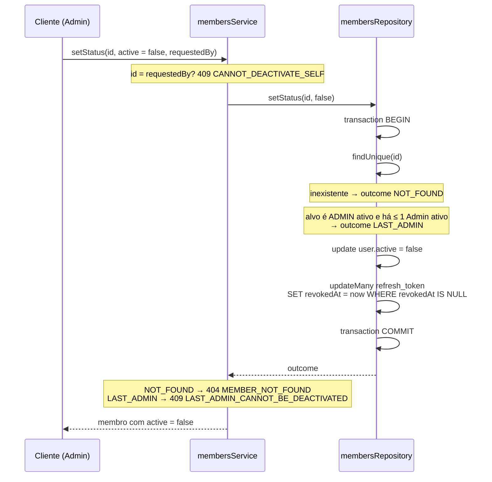
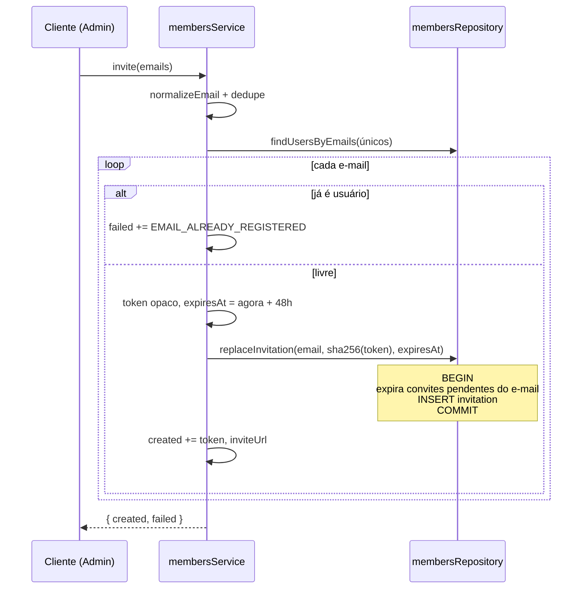

# Módulo: Members

## Objetivo

A gestão de membros pelo Admin: listar a equipe com pontuação e estagnação, ver um
membro, convidar por e-mail e ativar ou desativar contas. Quatro rotas, todas
`adminProcedure` — o roadmap § 1.5 reserva a gestão de membros ao Admin. O cadastro que
consome o convite é do módulo auth (`POST /auth/register`), não deste.

Cobre a Fase 1 (roadmap § 1.6). A listagem ganhou pontuação, nível e estagnação nas
entregas seguintes, sem mudar a rota.

Código em `packages/api/src/modules/members/`.

## Regras de negócio

### Listagem e detalhe

| # | Regra |
| --- | --- |
| RN01 | `GET /members` é paginado: `items`, `page`, `limit`, `total`, `totalPages`. `page` padrão 1 (mínimo 1), `limit` padrão 20, teto 100. `totalPages` tem mínimo 1; página além do fim devolve `items: []` |
| RN02 | `search` procura em nome **ou** e-mail, sem diferenciar maiúsculas. `status` é `ACTIVE`, `INACTIVE` ou `ALL` (padrão `ALL`). Parâmetro de query vazio (`?search=`) vale como ausente |
| RN03 | Ordenação por `name` ascendente. A lista não filtra por perfil: Admins aparecem junto com membros |
| RN04 | Cada item traz `points` (soma das atribuições **válidas**, `revokedAt IS NULL`), `kpiCount` (quantas atribuições válidas), `lastAssignmentAt` e `level` (`levelFor(points)` de `shared/gamification`). Membro sem atribuição vem com `0`, `0`, `null`. A soma é feita na mesma transação da página, só para os ids dela |
| RN05 | `daysWithoutKpi` conta dias inteiros (arredondados para baixo) desde a última atribuição válida; sem nenhuma, desde o cadastro (`createdAt`). `stagnant` é `true` a partir do 30º dia, inclusive — **só para membro ativo**: inativo nunca é estagnado. A regra vive em `shared/members/stagnation.ts`, compartilhada com o dashboard |
| RN06 | `GET /members/{id}` devolve o membro sem pontuação: `id`, `name`, `email`, `role`, `position`, `active`, `createdAt`. Id inexistente → 404 `MEMBER_NOT_FOUND`; id que não é UUID → 400. Nenhuma resposta do módulo expõe `passwordHash` |

### Convite

| # | Regra |
| --- | --- |
| RN07 | `POST /members/invitations` recebe um lote de 1 a 50 e-mails. Lista vazia, mais de 50 ou endereço malformado → 400 no schema, antes do service |
| RN08 | Os e-mails são normalizados (`trim` + minúsculas, `shared/email`) e deduplicados: `Novo@x.com` e ` novo@x.com ` no mesmo lote viram um convite só |
| RN09 | Cada endereço é independente. E-mail que já pertence a um usuário — ativo ou não — volta em `failed` com `code: "EMAIL_ALREADY_REGISTERED"` e não derruba os outros. Lote em que todos falham responde 200 com `created: []` |
| RN10 | O token é opaco (não é UUID, 32+ caracteres). O banco guarda só o SHA-256 (`invitation.tokenHash`); o token em texto puro existe apenas na resposta, em `token` e `inviteUrl` |
| RN11 | O convite expira em **48 horas**. `inviteUrl` é `{WEB_APP_URL}/invite/{token}` — montado de `WEB_APP_URL`, nunca de `CORS_ORIGIN` |
| RN12 | Reconvidar substitui: na mesma transação que cria o convite novo, os convites pendentes (não usados e não vencidos) do mesmo e-mail têm `expiresAt` levado para agora. Só o link mais recente vale |
| RN13 | A API não envia e-mail. Quem entrega o link ao convidado é o Admin, a partir de `inviteUrl` |

### Ativação e desativação

| # | Regra |
| --- | --- |
| RN14 | `PATCH /members/{id}/status` com `{ active }` ativa ou desativa. O usuário nunca é apagado: atribuições, reuniões e badges permanecem (roadmap § 1.6) |
| RN15 | O Admin não desativa a si mesmo: 409 `CANNOT_DEACTIVATE_SELF`, checado no service antes de qualquer acesso ao banco. `requestedBy` vem do contexto autenticado. Reativar a si mesmo é permitido |
| RN16 | O último Admin ativo não pode ser desativado: 409 `LAST_ADMIN_CANNOT_BE_DEACTIVATED`. A contagem de Admins ativos acontece dentro da transação da escrita e só roda quando o alvo é um Admin ativo |
| RN17 | Desativar revoga, na mesma transação, todos os refresh tokens ainda válidos do usuário. O access token em circulação para de valer na requisição seguinte, porque o `createContext` confere `active` no banco |
| RN18 | Id inexistente → 404 `MEMBER_NOT_FOUND`. Repetir o mesmo status não é erro: responde o membro como está |

## Fluxos

### Desativação

### Convite em lote

## Endpoints

| Método | Rota | Procedure | Descrição | Auth | Erros |
| --- | --- | --- | --- | --- | --- |
| GET | `/members` | `members.list` | Lista paginada com pontuação, nível e estagnação | ADMIN | 400, 401, 403 |
| GET | `/members/{id}` | `members.getById` | Dados de um membro | ADMIN | 400, 401, 403, 404 |
| POST | `/members/invitations` | `members.invite` | Convite em lote, até 50 e-mails | ADMIN | 400, 401, 403 |
| PATCH | `/members/{id}/status` | `members.setStatus` | Ativa ou desativa | ADMIN | 400, 401, 403, 404, 409 |

Anônimo recebe 401 e MEMBER recebe 403 em todas as rotas, sem chegar ao service — há
teste cobrindo as quatro.

### Erros

| Código | HTTP | Quando |
| --- | --- | --- |
| `MEMBER_NOT_FOUND` | 404 | `getById` ou `setStatus` com id inexistente |
| `CANNOT_DEACTIVATE_SELF` | 409 | Admin tenta desativar a própria conta |
| `LAST_ADMIN_CANNOT_BE_DEACTIVATED` | 409 | Desativar o único Admin ativo |
| `EMAIL_ALREADY_REGISTERED` | — | Não é lançado: aparece em `failed[].code` do convite |

`MEMBER_NOT_FOUND` e `EMAIL_ALREADY_REGISTERED` vivem em `shared/errors/common.errors.ts`
(usados também por auth, assignments e meetings); os outros dois, em `members.errors.ts`.

## Decisões relacionadas

| Documento | Assunto |
| --- | --- |
| [Roadmap § 1.5 e § 1.6](../MVP_API_ROADMAP.md) | Autorização por perfil, listagem, convite e desativação |
| [Módulo auth](auth.md) | Consumo do convite em `POST /auth/register` e validação em `validateInvite` |
| [ADR 0011](http://localhost:4000/docs/adr/0011-jwt-refresh-token-rotativo) | Refresh token rotativo — o que a desativação revoga |
| [ADR 0012](http://localhost:4000/docs/adr/0012-hash-de-senha-e-de-token) | bcrypt para senha, SHA-256 para token |
| [ADR 0020](http://localhost:4000/docs/adr/0020-token-de-convite-em-sha-256) | Token de convite guardado como SHA-256 |

A Fase 1 não tem spec: foi implementada antes de o formato existir
([`docs/specs/README.md`](../specs/README.md)).

## Consequências registradas

- O front consome `list` em `apps/web/src/pages/admin/members/` e no Modo Reunião,
  `setStatus` em `use-member-status.ts` e `invite` em `apps/web/src/lib/members.ts`.
  `getById` não tem consumidor: o perfil de membro vem de `profile`.
- A trava de último Admin conta dentro da transação, mas sem `SELECT … FOR UPDATE`: duas
  desativações simultâneas dos dois últimos Admins podem passar. Com um Admin só no seed,
  não é caso real hoje.
- Não há rota para listar, reenviar ou cancelar convite pendente — reconvidar (RN12) é o
  reenvio. Nem para trocar perfil (`role`) ou cargo (`position`).
- A busca por usuário existente no convite compara o e-mail normalizado com o que está
  gravado; usuário gravado com maiúsculas não seria achado no banco. Hoje não acontece: o
  cadastro grava o e-mail do convite, já normalizado, e o seed usa endereços em
  minúsculas.
