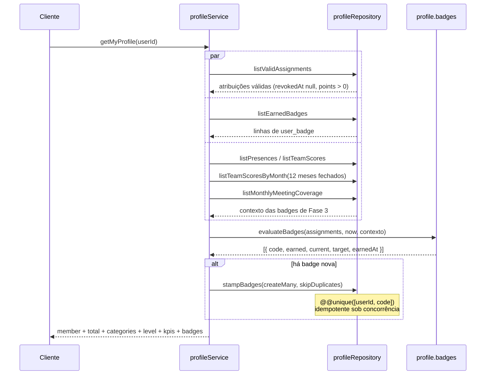
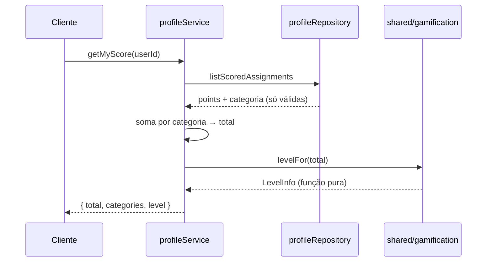
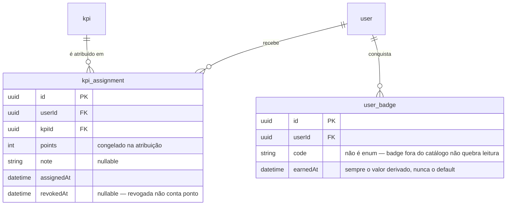

# Módulo: Profile

## Objetivo

Tudo o que a tela de perfil do membro mostra, calculado no servidor: pontuação
acumulada, pontuação por categoria, histórico de KPIs, nível e as dez badges de
conquista. Cobre as entregas 2C (pontuação, níveis e perfil) e 2D (badges) da
Fase 2, e a 3E (as quatro badges de Fase 3).

Código em `packages/api/src/modules/profile/`.

## Regras de negócio

### Pontuação e nível (2C)

| # | Regra |
| --- | --- |
| RN01 | A pontuação é a soma das atribuições com `revokedAt IS NULL`, usando o `points` **congelado** na atribuição — editar o KPI depois não reescreve o passado |
| RN02 | Categoria sem nenhum ponto vem como `0`, nunca omitida do bloco `categories` |
| RN03 | O nível é **função pura** da pontuação válida: não há estado guardado, e revogar uma atribuição derruba o total e o nível junto. A regra mora em `shared/gamification/levels.ts` desde a 3D — o dashboard também a usa, e módulo não importa módulo |
| RN04 | São 21 limiares (níveis 0 a 20). O passo dobra a cada bloco de cinco níveis — 100, 200, 400, 800 |
| RN05 | As cinco faixas trocam nos níveis 5, 10, 15 e 20: `INICIANTE` (0–4), `COMPROMETIDO` (5–9), `DESTAQUE` (10–14), `ELITE` (15–19), `LENDA` (20) |
| RN06 | Nível 20 é o teto: acima de 7.500 os pontos seguem somando, mas `nextLevel`, `nextLevelPoints` e `nextTier` vêm `null` e `progress` vem 100 |
| RN07 | `progress` é o percentual de pontos dentro do nível atual — nunca o percentual do caminho total |
| RN08 | O perfil público (`/members/{id}/profile`) devolve o mesmo conteúdo do `/me/profile`, exceto: **sem e-mail**, **sem status de ativação** e histórico **só com atribuições não revogadas e de pontuação positiva** (`points > 0`). Membro inativo ou inexistente → 404 |
| RN08a | O perfil público também traz `rankingPosition` e `teamSize`: a posição no ranking **geral** (sem janela) entre os usuários ativos e o tamanho desse grupo — o mesmo número de `GET /ranking?period=all` e do `rankingPosition` do dashboard do membro (pontuação com `revokedAt IS NULL`, sem filtro de sinal, desempate de `shared/ranking/rank.ts`). O admin vê a posição nos detalhes do membro e o ranking abre o mesmo perfil. Membro que sai do grupo ativo entre as leituras → 404 |

### Badges (2D)

| # | Regra |
| --- | --- |
| RN09 | O catálogo tem **dez badges**, sempre presentes na resposta, na ordem do catálogo. Badge bloqueada não é omitida |
| RN10 | O catálogo é **código, não dado**: array em `profile.badges.ts`, com o avaliador ao lado de cada entrada. Badge nova é commit e teste, sem migration nem seed |
| RN11 | Todo avaliador recebe a mesma lista: atribuições com `revokedAt IS NULL` **e `points > 0`**, ordenadas por `assignedAt` crescente. KPI de pontuação não positiva não avança badge — punição não é conquista |
| RN12 | `ALL_CATEGORIES` deriva o alvo do **enum `KpiCategory`**, não de uma constante: categoria nova sobe o alvo sozinha |
| RN13 | O streak conta **semanas ISO consecutivas** com pelo menos uma atribuição. A aritmética usa a segunda-feira da semana em `America/Sao_Paulo` (duas semanas são consecutivas quando as segundas-feiras distam 7 dias), nunca a string `YYYY-Www` — que quebra na virada de ano |
| RN14 | A sequência **atual** é a que termina na semana corrente ou na anterior — a semana corrente ainda está em curso, e zerar o streak na segunda de manhã seria punir o calendário |
| RN15 | Quem decide `earned` e `earnedAt` é a **melhor sequência histórica**, que nunca regride; a sequência atual regride quando fura e alimenta só o `current` |
| RN16 | `earnedAt` é **derivado da atribuição que fechou a regra**, nunca `now()` |
| RN17 | Badge conquistada é **grudenta**: `earned`, `earnedAt` e `progress: 100` nunca regridem, mesmo que o KPI que a gerou seja revogado e o `current` caia abaixo do `target`. O front não pode derivar `earned` de `current >= target` |
| RN18 | O carimbo acontece na **leitura** do perfil: avaliação em memória, e as badges recém-ganhas entram em `createMany({ skipDuplicates })` sob `@@unique([userId, code])`. Linha já existente não é regravada — `earnedAt` persistido é imutável |
| RN19 | `progress` com `target: null` é `0` ou `100`, sem meio-termo: posição e cobertura não são contagem, e barra de progresso ali não significaria nada |
| RN20 | Badge com `available: false` ignora até uma linha legada em `user_badge` — conquista invisível não motiva ninguém. Desde a 3E as dez estão disponíveis; a guarda fica para a próxima badge declarada antes de ter regra |
| RN21 | `code` de `user_badge` é `String`, não enum: linha de badge que saiu do catálogo é ignorada na leitura em vez de quebrar |

### Badges de Fase 3 (3E)

| # | Regra |
| --- | --- |
| RN22 | As quatro calculam **ao vivo**; `ranking_snapshot` não é usado — ele só existe se alguém abriu a tela de ranking, e conquista não pode depender de tráfego de leitura |
| RN23 | `TEN_MEETINGS`: contagem de `meeting_attendee` com `presentAt IS NOT NULL`. Escalado e ausente não conta; reunião ainda aberta conta. `earnedAt` é o `presentAt` da **décima** presença. Conta `presentAt` mesmo que o assignment de presença tenha sido revogado — a badge olha a presença, não o KPI |
| RN24 | `TOP_THREE`: `position <= 3` no ranking geral (sem janela) com o desempate de três níveis de `shared/ranking/rank.ts`. `current` 0 ou 1, `target: null`. `earnedAt` é o `assignedAt` da atribuição válida **mais recente** do membro — aproximação deliberada, porque posição não tem evento que a fecha. Quem não pontuou não ganha, mesmo que a equipe inteira esteja em zero |
| RN25 | `PERFECT_MONTH`: em algum **mês já fechado**, presença em **todas** as reuniões encerradas daquele mês, com ao menos uma. Reunião aberta é ignorada; reunião com `date` até o `createdAt` do membro é ignorada; o mês corrente nunca concede. `earnedAt` é o maior `closedAt` das reuniões daquele mês. O mês da reunião é lido pelo dia UTC de `meeting.date`, que a 3A grava como meia-noite UTC do dia |
| RN26 | `PODIUM_STREAK`: três meses de calendário consecutivos com `position <= 3` e pontos no ranking mensal, recalculado com `rank()` em memória sobre **uma** consulta dos últimos **12 meses fechados**. Mês sem nenhuma atribuição da equipe quebra a sequência. `current` é a **melhor** sequência histórica, `target` 3. `earnedAt` é a última atribuição do membro no terceiro mês da primeira sequência que chegou a três |
| RN27 | Badge e ranking divergem sobre pontuação negativa, de propósito: o `GET /ranking` soma tudo; `TOP_THREE` e `PODIUM_STREAK` usam só atribuições com `points > 0` (RN11). Um membro pode aparecer em 3º no ranking e não ter `TOP_THREE` |
| RN28 | O fuso das badges é o `TIMEZONE` de `shared/time/` — a constante própria que a 2D tinha em `profile.badges.ts` deixou de existir, sem mudar o streak semanal |

## Fluxos

### Leitura do perfil com carimbo de badges



O carimbo mora no caminho de leitura de propósito: a regra continua pura e
testável sem banco, e não é preciso gatilho no fluxo de atribuição — o que
manteria `modules/profile` importando `modules/assignments`. Se um dia a escrita
no GET incomodar (cache, réplica de leitura), a saída é um job que varre
membros, não voltar ao gatilho.

### Pontuação e nível



## Modelo de dados



Schemas em `packages/db/prisma/schema/user-badge.prisma`. A tabela `user_badge`
tem `@@unique([userId, code])` — é o que sustenta o `skipDuplicates` — e índice
em `userId` para a leitura do perfil.

## Endpoints

Prefixo `/rpc` para o client tipado, `/api-reference` para REST/OpenAPI.

| Método | Rota | Descrição | Auth | Erros |
| --- | --- | --- | --- | --- |
| GET | `/me/score` | Total, pontuação por categoria e nível | `Bearer` | 401 |
| GET | `/me/kpis` | Histórico de atribuições (filtro opcional `revoked`) | `Bearer` | 401 |
| GET | `/me/kpis/summary` | Quantidades e pontuação por categoria, última atribuição | `Bearer` | 401 |
| GET | `/me/profile` | Agregado completo, com e-mail, status e badges | `Bearer` | 401 |
| GET | `/members/{id}/profile` | Perfil público de outro membro (recorte por campo) | `Bearer` (ADMIN e MEMBER) | 401, 404 `MEMBER_NOT_FOUND` |

O `code` do erro vai em `data.code` na resposta — ramifique por ele, não pela mensagem.

### Exemplo

```bash
curl -s -X GET http://localhost:3000/rpc/me/profile \
  -H "Authorization: Bearer $ACCESS_TOKEN"
```

A seção `badges` vem com as dez entradas em ordem de catálogo. Uma badge
conquistada e depois esvaziada por revogação responde `earned: true`,
`earnedAt: <data>`, `progress: 100`, `current: 4`, `target: 5` — a combinação
que o front não pode derivar sozinho.

Exemplos de resposta salvos também na collection Postman
(`Profile (2C)` → `Meu perfil` e `Perfil público do membro`).

## Decisões relacionadas

| Documento | Assunto |
| --- | --- |
| [Spec 2C](../specs/fase-2c-pontuacao-e-niveis.md) | Pontuação, níveis e perfil |
| [Spec 2D](../specs/fase-2d-badges.md) | Catálogo de badges, streak semanal, carimbo na leitura |
| [Spec 3E](../specs/fase-3e-badges-de-fase-3.md) | As quatro badges de Fase 3 |
| [ADR 0009](http://localhost:4000/docs/adr/0009-camadas-router-service-repository) | Camadas Router, Service e Repository |
| [ADR 0010](http://localhost:4000/docs/adr/0010-erros-de-dominio) | Erros de domínio desacoplados do oRPC |

## Dependências

- `packages/db` — Prisma, acessado só pelo repository
- `packages/api/src/shared/` — `handle`, `DomainError`, `gamification` (níveis),
  `ranking` (`rank`, janelas mensais) e `time` (fuso)

O módulo **não importa** `members`, `kpis`, `assignments`, `meetings` nem `ranking` —
lê `meeting_attendee`, `meeting` e `kpi_assignment` pelo próprio repository — o carimbo na
leitura existe justamente para não precisar de gatilho no fluxo de atribuição.
Badges pertencem a `profile` pela definição do roadmap § 2.9: perfil é o
agregado de pessoais + pontuação + categorias + KPIs + nível + badges.

## Pendências conhecidas

| Item | Situação |
| --- | --- |
| Custo da leitura de perfil | Desde a 3E, `GET /me/profile` faz mais quatro consultas, uma sobre 12 meses da equipe. Se doer, a saída é um job de carimbo — e aí `ranking_snapshot` vira fonte legítima |
| Teto de 12 meses de `PODIUM_STREAK` | Sequência anterior a isso nunca é carimbada, sem aviso. O produto tem menos de um ano de dados |
| Alvos de `TWENTY_FIVE_KPIS` e dos streaks | Calibrados por estimativa de ritmo semanal sobre o seed; recalibrar com dados reais |
| Front consome mock | `apps/web/src/mocks/badges.ts` ainda usa o formato antigo (`b1`–`b10`, raridade acentuada) — a migração do front é story de web |
| `GET /me/profile` pode escrever | Consequência aceita do carimbo na leitura; só grava quando há badge nova e é idempotente |
