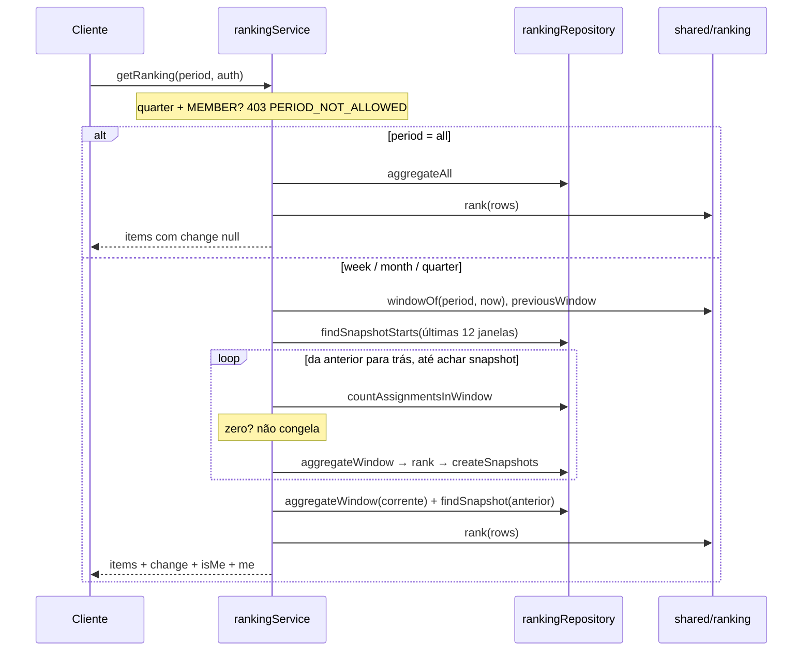
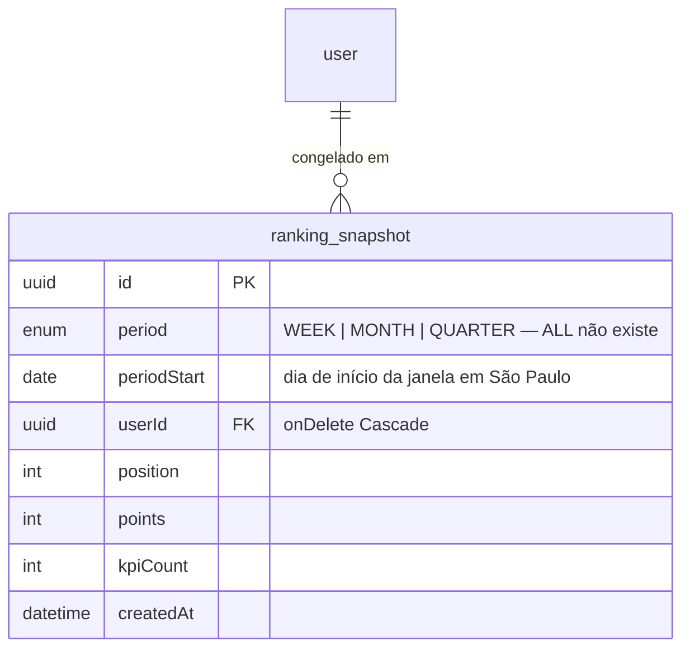

# Módulo: Ranking

## Objetivo

O ranking da equipe por período, com desempate determinístico, destaque do usuário
autenticado e variação de posição contra o período anterior. Uma rota,
`protectedProcedure`: o ranking é público dentro da equipe desde o roadmap § 1.5. Cobre a
entrega 3B da Fase 3.

Código em `packages/api/src/modules/ranking/`, com as regras puras em
`packages/api/src/shared/ranking/` e o fuso em `packages/api/src/shared/time/`.

## Regras de negócio

| # | Regra |
| --- | --- |
| RN01 | `period` aceita `week`, `month`, `quarter` e `all`, padrão `all`. Valor fora do enum é 400 no schema, antes do service |
| RN02 | `quarter` é do Admin: MEMBER recebe 403 `PERIOD_NOT_ALLOWED`. A guarda mora no service — a rota é dos dois papéis, o que muda é o valor aceito num campo, e isso é regra de negócio, não guard de perfil |
| RN03 | As janelas são de calendário em `America/Sao_Paulo`: semana ISO (segunda 00:00 até a segunda seguinte), mês e trimestre de calendário. `all` não tem janela. O fuso é constante em `shared/time/`, não variável de ambiente — mudar de fuso reescreveria o passado |
| RN04 | Pontuação da janela: `SUM(points)` e `COUNT(*)` das atribuições com `revokedAt IS NULL` e `assignedAt` em `[início, fim)`. Sem filtro de `points > 0`: pontuação negativa subtrai e ainda conta em `kpiCount` (RB10) |
| RN05 | Todo usuário `active = true` entra, ADMIN incluído (PRD § 6), mesmo com `points: 0` e `kpiCount: 0`. Usuário desativado some do ranking inteiro, inclusive dos períodos em que pontuou |
| RN06 | Desempate em três níveis: `points` DESC, `kpiCount` DESC, `name` ASC com `Intl.Collator("pt-BR")` — `Ávila` antes de `Bueno`. O `userId` só fixa a ordem entre requisições em empate absoluto |
| RN07 | Posições são sequenciais (1, 2, 3), nunca compartilhadas — `TOP_THREE` da 3E precisa de uma resposta única para "está no top 3" |
| RN08 | `change` = posição no snapshot da janela anterior − posição agora. Positivo é subida. Ausente do snapshot, ou janela anterior sem snapshot, é `null` — "não sei" é diferente de `0`, "não mudou". `period=all` tem `change: null` sempre |
| RN09 | O snapshot é materializado **na leitura**, não por job: só janela **fechada** congela (a corrente ainda muda); janela sem nenhuma atribuição não vira snapshot (congelaria o alfabeto, não desempenho) |
| RN10 | A materialização anda para trás a partir da janela anterior até encontrar snapshot existente, com **teto de 12 janelas** — uma janela que ninguém leu não some, e a primeira leitura de um banco antigo não vira requisição longa |
| RN11 | Gravação com `createMany({ skipDuplicates: true })` sob `@@unique([period, periodStart, userId])`: duas leituras simultâneas depois da virada não duplicam linha |
| RN12 | `entry.position` é **colocação**; o cargo fica em `entry.member.position`. O aninhamento resolve a colisão de nomes sem renomear o `position` do resto da API |
| RN13 | `isMe` marca exatamente a entrada do autenticado, e o bloco `me` repete os números dela. `me` é `null` quando o autenticado não está no ranking (Admin desativado com token válido) |
| RN14 | Sem paginação: o ranking é da equipe inteira, e a tela precisa da posição de qualquer um |

## Fluxos

### Leitura com materialização



## Modelo de dados



Migration `20260919200339_ranking_snapshot`. `periodStart` é `@db.Date` — a chave é o
dia, não o instante. `ALL` fica fora do enum porque não existe janela anterior a "tudo".

## Endpoints

| Método | Rota | Descrição | Auth | Erros |
| --- | --- | --- | --- | --- |
| GET | `/ranking?period=` | Ranking da equipe no período | `Bearer` (ADMIN e MEMBER) | 400, 401, 403 `PERIOD_NOT_ALLOWED` |

```json
{
  "period": "month",
  "periodStart": "2026-09-01",
  "periodEnd": "2026-09-30",
  "items": [
    {
      "position": 1,
      "member": { "id": "...", "name": "Maria", "position": "Designer", "role": "MEMBER" },
      "points": 1200,
      "kpiCount": 25,
      "change": 2,
      "isMe": false
    }
  ],
  "me": { "position": 2, "points": 1100, "kpiCount": 22, "change": null }
}
```

`periodStart` e `periodEnd` vêm `null` em `period=all`. Collection Postman: pasta
`Ranking (3B)`.

## Regras puras compartilhadas

| Arquivo | Expõe | Quem usa |
| --- | --- | --- |
| `shared/time/timezone.ts` | `TIMEZONE`, `dayOf`, `dayStart`, `dayEnd`, `addDays` | ranking, assignments (3C), profile (3E) |
| `shared/ranking/periods.ts` | `windowOf(period, at)`, `previousWindow` | ranking, dashboard (3D), profile (3E) |
| `shared/ranking/rank.ts` | `rank(rows)` — ordena, desempata, numera | ranking, dashboard (3D), profile (3E) |

Sem Prisma e sem módulo: testáveis sem banco, e a ordenação existe em um lugar só.

## Decisões relacionadas

| Documento | Assunto |
| --- | --- |
| [Spec 3B](../specs/fase-3b-ranking.md) | Janelas, desempate, snapshot e `change` |
| [ADR 0009](http://localhost:4000/docs/adr/0009-camadas-router-service-repository) | Camadas Router, Service e Repository |

## Consequências registradas

- `ranking_snapshot` serve `change` e nada mais. As badges da 3E calculam ao vivo com
  `rank()` — conquista não pode depender de alguém ter aberto a tela de ranking.
- Um banco parado por mais de 12 janelas perde as mais antigas; como `change` só olha a
  anterior, o custo é zero hoje.
- O front consome a rota em `apps/web/src/components/ranking/`. `quarter` só aparece
  para o admin; a URL do membro rebaixa `trimestre` para `geral`, então o 403
  `PERIOD_NOT_ALLOWED` não é alcançável pela tela.
- Não há ranking por categoria — é `groupBy` com mais uma coluna quando virar requisito.
